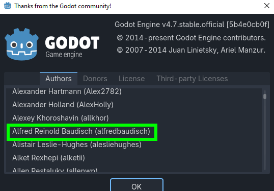
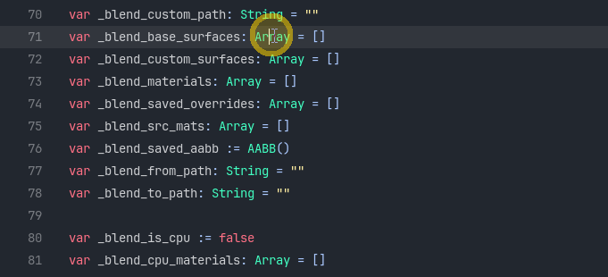

About
=========================================

Vertex Studio is made by **Alfred Reinold Baudisch** (aka: *alfredbaudisch*, *Pardall* and *Pardallgames*). I am a long time software developer and database architect, since the 1990s, with more than 30 years of experience, and I work as a backend developer.

On my free time, I contribute to open-source, I make games, tools and retro-style graphics experiments. I love PS1, N64 early 2000s game graphics, I love pre-rendered graphics and backgrounds and Gouraud and Phong shading.

Links
-----

- Website, dev blog and experiment logs: https://alfredbaudisch.com
- Games: https://splitpainter.itch.io and https://pardallgames.com
- Vertex Studio on itch.io (Free and Pro): https://splitpainter.itch.io/vertex-studio
- Vertex Studio on the Godot Asset Store (Free): https://store.godotengine.org/asset/alfredbaudisch/vertex-studio/

Social media
-------------

- Bluesky: https://bsky.app/profile/alfredbaudisch.com
- Mastodon: https://mastodon.gamedev.place/@alfredbaudisch
- Twitter: https://x.com/alfredbaudisch
- YouTube: https://www.youtube.com/@LaboratorioDoPardall

The experiment that started Vertex Studio
-----------------------------------------

Vertex Studio exists because I was experimenting with making graphics similar to Banjo-Kazooie from the Nintendo 64 (N64) in Blender and Godot and I wanted a faster way to do Banjo-Kazooie-like texture blending in Godot (which uses the vertex colors alpha to blend textures). This was in November/2024.

So, I started making Vertex Studio by the end of November/2025. After working on it here and there for more than 7 months, and then crunching it to the finish line in July/2026, Vertex Studio, as a Godot plugin, was finished and released.

See my Banjo-Kazooie experimentation posts from november/2025: `Exploring and making Nintendo 64 graphics <https://alfredbaudisch.com/experiments/3d-art/exploring-making-nintendo-64-graphics-n64/>`_.

Godot projects and contributions
--------------------------------------------

I started using Godot in 2019 to create little tools and then game jam games. I also contributed more than a dozen times to Godot itself, I am listed as a "Developet" in the Godot's "About" dialog. And I have published two Godot courses, one of them which have more than 1000 students.

Some of my contributions and creations (I keep the complete list in `my website <https://alfredbaudisch.com/projects/open-source/my-godot-projects-and-contributions/>`_):

Godot Pull-Requests (PRs)
^^^^^^^^^^^^^^^^^^^^^^^^^^

|br|

- **Feature:** `Add Selection and Caret for Next Occurrence of Selection <https://github.com/godotengine/godot/pull/67644>`_
- **Editor Enhancement:** `While the Script Editor Plugin is active, makes it optional to switch Editor Plugins when selecting Nodes in the Scene Tree <https://github.com/godotengine/godot/pull/63344>`_
- `All PRs <https://github.com/godotengine/godot/pulls?q=author%3Aalfredbaudisch+>`_

Open-Source Projects and Addons
^^^^^^^^^^^^^^^^^^^^^^^^^^^^^^^^

.. image:: https://alfredbaudisch.com/media/wp-content/2021/08/godello-drag-and-drop-example.gif
   :alt: Godello drag and drop example
   :width: 100%

- **User Interface Project:** `Godello <https://alfredbaudisch.com/projects/open-source/godello/>`_
- **Game System:** `Dynamic Inventory System from Zelda Breath of the Wild <https://alfredbaudisch.com/projects/open-source/dynamic-inventory-system-for-godot/>`_
- **Library:** `Godot Phoenix Channels <https://github.com/alfredbaudisch/GodotPhoenixChannels>`_
-  **Shader:** `Godot Engine In-game Splat Map Texture Painting (Dirt Removal Effect) <https://alfredbaudisch.com/blog/gamedev/godot-engine/godot-engine-in-game-splat-map-texture-painting-dirt-removal-effect/>`_

Courses
^^^^^^^^

- `Dynamic Inventory System and User Interfaces <https://alfredbaudisch.com/projects/education/dynamic-inventory-system-and-user-interfaces-with-godot-course/>`_
- `Make Games Without Programming using Godot (archived) <https://alfredbaudisch.com/projects/education/make-games-without-programming-using-godot/>`_

Articles
^^^^^^^^

- `Standalone Tools and Applications Made with Godot GUI <https://alfredbaudisch.com/blog/gamedev/godot-engine/standalone-applications-made-with-godot-gui-softwares-tools/>`_
- `Godot 4.0 is here! Overview of Quality of Life Features and Workflow Enhancements <https://alfredbaudisch.com/blog/godot-4-0-is-here-release-overview-quality-of-life-features/>`_
- `From Unity to Godot: Game Objects and Components in Godot? <https://alfredbaudisch.com/blog/gamedev/from-unity-to-godot-where-are-my-game-objects-and-components/>`_
- `In-game vertex painting with Godot Engine (Wash Car Effect) <https://alfredbaudisch.com/experiment-logs/in-game-vertex-painting-with-godot-engine-wash-car-effect/>`_
- `Godot Engine Lovable Features (plus UE and Unity similarities) <https://alfredbaudisch.com/blog/gamedev/godot-engine/godot-engine-lovable-features-and-characteristics/>`_
- `Godot's 3D Workflow Issues, Inconsistencies, and Confusion <https://alfredbaudisch.com/blog/gamedev/godot-engine/godots-3d-confusing-workflow-inconsistencies-conflicting-behaviours-and-annoyances/>`_
- `How to Properly Setup Git for Unreal Engine, Unity and Godot Projects <https://alfredbaudisch.com/blog/gamedev/how-to-properly-setup-git-for-unreal-engine-unity-and-godot-projects/>`_

Videos
^^^^^^

- `From Unity to Godot: Game Objects and Components in Godot? <https://www.youtube.com/watch?v=c3KAhT7Xalo>`_
- `🇧🇷 6 Open-Source Projects to Test 3D in Godot 3.4 <https://www.youtube.com/watch?v=EKtGzjnUJS4>`_
- `🇧🇷 Introdução Godot Engine – Tutorial rápido de Godot, Nodes, Scenes, GDScript – 1 <https://www.youtube.com/watch?v=gvMmYw8fDJU>`_

Game Jam Games
^^^^^^^^^^^^^^

- `Kaoamaru Kaiju <https://alfredbaudisch.com/projects/games/kaoamaru-kaiju/>`_
- `The Spectrum Soup <https://alfredbaudisch.com/projects/games/the-spectrum-soup/>`_
- `The Blue Bedroom <https://alfredbaudisch.com/projects/games/the-blue-bedroom/>`_

Help, bugs and licensing
------------------------

- Questions and help: the :doc:`faq`, the :doc:`troubleshooting` page and the :doc:`support` page.
- Bug reports: `GitHub issues <https://github.com/alfredbaudisch/godot-vertex-studio-docs/issues>`_.
- Licensing terms: the :doc:`license` page.

.. |br| raw:: html

      