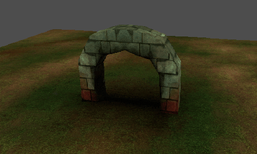
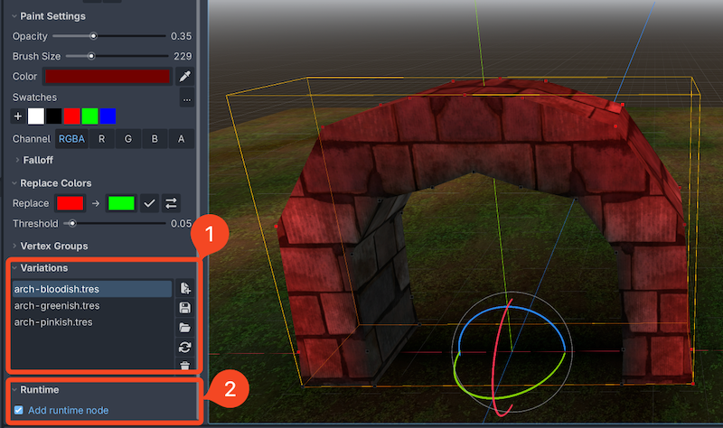

Blending and changing variations in-game/at runtime
=======================================================================

Using the ``VSRuntime`` API from Vertex Studio Pro, you can switch to another variation of a mesh or blend/tween between variations of a mesh at runtime. This is useful for creating dynamic effects in your game or simply using or switching between different variations of the same mesh, non-destructively.

.. note::
    This tutorial requires Vertex Studio Pro ⭐.

Sample project
--------------

Download the sample project and sample code from `GitHub <https://github.com/alfredbaudisch/GodotVertexStudio_Tutorial/archive/refs/heads/realtime-variation-blending.zip>`_. Extract the zip file and open the project in Godot.

Files relevant to this tutorial are in the folder ``Advanced/RuntimeBlending``.

.. note::
    Although the files downloaded here contain the same files as the :doc:`quickstart-tutorial` files, this new zip is different because it comesfrom another Git branch, containing a new folder (``Advanced/RuntimeBlending``).

Setup
-----

1. A mesh edited with Vertex Studio must have multiple ``Variations``. See :ref:`tutorial-variations` from the quickstart tutorial in order to learn how to create variations.
2. The ``VSRuntime`` node must be added to the ``MeshInstance3D`` node with variations. For that, click ``Add runtime node`` in the ``Runtime`` section.

If you open the ``Game`` scene from the sample files (inside ``Advanced/RuntimeBlending``), click the ``Archway`` node in the Scene Tree, open Vertex Studio and scroll down to ``Variations`` to see the variations included. Double-click a variation in order to activate and preview it.

Changing variations in the Inspector
------------------------------------

You can change the variation of a ``MeshInstance3D`` that has the ``VSRuntime`` node from the Inspector by clicking the ``Variation`` dropdown and selecting a different variation. In order for it to be accessible, since the ``Archway`` is an instanced scene, ``Editable Children`` must be enabled.

This is useful for non-destructively having different versions of the same mesh, for example, when building levels or environments.

This has already been explained in detail in :ref:`tutorial-variations`, but let's see it here again with the new sample files:

.. video:: _static/videos/blending-variations/change-variation-inspector.mp4
    :width: 100%

Changing variations at runtime via code
----------------------------------------

``VSRuntime`` has a public API with two ways to change the variation of a ``MeshInstance3D`` at runtime instantly (no blending nor tweening involved):

- ``runtime.set_active_snapshot(variation_resource_path)``
- ``runtime.variation = variation_index``: variation index (``int``) is the same as the ``MeshInstance3D`` ``VSRuntime`` node ``Variation`` property in the Inspector.

Examples:

.. code-block:: python

	runtime.set_active_snapshot("res://Variations/arch-greenish.tres")

	# or...
	runtime.variation = 2
