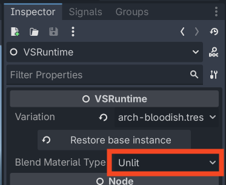

Blending and changing variations in-game/at runtime
=======================================================================

Using the ``VSRuntime`` Node and API from Vertex Studio Pro, you can switch to another variation of a mesh or blend/tween between variations of a mesh at runtime. This is useful for creating dynamic effects in your game or simply using or switching between different variations of the same mesh, non-destructively.

.. important::
    Variations are a snapshot of everything related to a mesh in Vertex Studio at the time the Variation is saved. The variation includes the vertex colors, vertex topology (positions, normals, tangents), selections active in Vertex Studio and sets of vertex groups that you created(if any).

    When you switch to another variation (or snapshot as they are called internally), all these changes are applied and the mesh changes to everything that is in the snapshot.

    So are not only blending between vertex colors (which is already quite powerful and pretty cool), but if you optionally have different normals in different variation files for that mesh (for example, if you used the ``Paint Normals`` brush), you are also going to blend between different normals, creating truly different looks for the same mesh.

.. image:: _static/images/variation-blending/variationtween.gif

.. note::
    This tutorial requires Vertex Studio Pro ⭐.

Sample project
--------------

Download the sample project and sample code from `GitHub <https://github.com/alfredbaudisch/GodotVertexStudio_Tutorial/archive/refs/heads/realtime-variation-blending.zip>`_. Extract the zip file and open the project in Godot.

Files relevant to this tutorial are in the folder ``Advanced/RuntimeBlending``.

.. note::
    Although the files downloaded here contain the same files as the :doc:`quickstart-tutorial` files, this new zip is different because it comesfrom another Git branch, containing a new folder (``Advanced/RuntimeBlending``).

Setup
-----

1. A mesh edited with Vertex Studio must have multiple ``Variations``. See :ref:`tutorial-variations` from the quickstart tutorial in order to learn how to create variations.
2. The ``VSRuntime`` node must be added to the ``MeshInstance3D`` node with variations. For that, click ``Add runtime node`` in the ``Runtime`` section.

If you open the ``Game`` scene from the sample files (inside ``Advanced/RuntimeBlending``), click the ``Archway`` node in the Scene Tree, open Vertex Studio and scroll down to ``Variations`` to see the variations included. Double-click a variation in order to activate and preview it.

.. image:: _static/images/variation-blending/setup.png

Changing variations in the Inspector
------------------------------------

You can change the variation of a ``MeshInstance3D`` that has the ``VSRuntime`` node from the Inspector by clicking the ``Variation`` dropdown and selecting a different variation. In order for it to be accessible, since the ``Archway`` is an instanced scene, ``Editable Children`` must be enabled.

This is useful for non-destructively having different versions of the same mesh, for example, when building levels or environments.

This has already been explained in detail in :ref:`tutorial-variations`, but let's see it here again with the new sample files:

.. video:: _static/videos/blending-variations/change-variation-inspector.mp4
    :width: 100%

Changing variations at runtime via code
----------------------------------------

``VSRuntime`` has a public API with two ways to change the variation of a ``MeshInstance3D`` at runtime instantly (no blending nor tweening involved):

- ``runtime.set_active_snapshot(variation_resource_path)``
- ``runtime.variation = variation_index``: variation index (``int``) is the same as the ``MeshInstance3D`` ``VSRuntime`` node ``Variation`` property in the Inspector.

Examples:

.. code-block:: python

	runtime.set_active_snapshot("res://Variations/arch-greenish.tres")

	# or...
	runtime.variation = 2

Blending / tweening between variations at runtime
------------------------------------------------

To blend / tween between variations at runtime, ``VSRuntime`` provides a public API with methods for GPU and CPU blending.

- **GPU blending**: faster, but uses two custom shaders (lit or unlit), and your mesh cannot have a custom shader, as it's going to be overriden by the custom shader while it's blending.
- **CPU blending**: slower, but your mesh can have a custom shader.

.. warning::
    Blending/tweening variations at runtime is VERY much still EXPERIMENTAL and there could be performance implications.

    Changing to a variation directly and instantly (even at runtime, as shown above) is much faster and more efficient (and it's production ready).

GPU blending
^^^^^^^^^^^^^

When using GPU blending, you must choose the blend material type that you want to use: Unlit or Lit (Unlit by default). Select the ``VSRuntime`` node of the mesh to be blended and in the Inspector, select the material type in the ``Blend Material Type`` dropdown.

API:

.. code-block:: python

	@signal snapshot_blend_finished(to_path: String)
	func tween_snapshots(from_path: String, to_path: String, duration: float = 1.0) -> bool
	func tween_to_snapshot(to_path: String, duration: float = 1.0) -> bool
	func stop_snapshot_blend() -> void

Example:

.. code-block:: python

	# Signal to know when the blending is finished
	runtime.snapshot_blend_finished.connect(_on_snapshot_blend_finished)

	# Blend to the snapshot "res://Variations/arch-bloodish.tres" in 1 second
	runtime.tween_to_snapshot("res://Variations/arch-bloodish.tres", 1.0)

	func _on_snapshot_blend_finished(reached_path: String):
	    # Determine the next snapshot to blend to
	    if reached_path == "res://Variations/arch-bloodish.tres":
	        to_path = "res://Variations/arch-greenish.tres"
	    else:
	        to_path = "res://Variations/arch-bloodish.tres"

	    # Blend to the next snapshot
	    runtime.tween_to_snapshot(to_path, 1.0)

CPU blending
^^^^^^^^^^^^^

When using CPU blending, your mesh can have a custom shader and there's no shader overriden by ``VSRuntime``.

The code is the same as GPU blending, except that the methods are appended with ``_cpu``:

.. code-block:: python

	@signal snapshot_blend_finished(to_path: String) # same signal as GPU blending
	func tween_snapshots_cpu(from_path: String, to_path: String, duration: float = 1.0) -> bool
	func tween_to_snapshot_cpu(to_path: String, duration: float = 1.0) -> bool
	func stop_snapshot_blend_cpu() -> void

Sample code and sample scene
^^^^^^^^^^^^^^^^^^^^^^^^^^^^^

Blending is available in the ``Game`` scene and the ``Game.gd`` script. Just run it to see it in action!

.. video:: _static/videos/blending-variations/blending-runtime.mp4
    :width: 100%