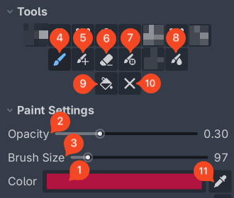

Brushes and Painting Tools
=========================================

Shared Paint Settings
----------------------

1. Color: the current active color to be painted. Click to open Godot's color picker.
2. Opacity: the current active opacity to be painted. All brushes make use of the opacity setting.
3. Brush Size: current brush size / brush radius to cover the viewport. Size in screen pixels (size constant regardless of the viewport's zoom level).

Painting Tools
--------------

4. Paint Brush (:kbd:`B`): the default painting tool. Hold the left mouse button and drag in the viewport to paint.
5. Paint Brush (Additive mode): the same as the Paint Brush, but in additive blending mode.
6. Eraser (:kbd:`Shift+E`): remove color (also affected by the opacity setting).

7. Precision Paint Brush: add the color of a single vertex under the cursor to the current active color with the current opacity. If opacity is 100%, the vertex color will be fully replaced by the current active color.

    - Useful when there are big clumps of vertices nearby where you want precision, and especially useful when painting individual vertices in Split Shared Vertices mode:
    .. image:: _static/images/manual/painting-precision.gif

8. Blur Brush: a smoothing brush that nudges each vertex's color under the brush radius toward the average of its 1-ring neighbours (crossing hard-edge seams too), creating soft gradients.

9. Fill All / Fill Selection (:kbd:`G`): fill every vertex or just the active selection.

    - Fill also respects opacity, so filling repeatedly builds the color up.

10. Erase All / Erase from Selection

    - Erase All does not respect opacity, it will completely remove the color of the all vertices or all vertices in the active selection.

11. Color Picker: pick the color of the vertex under the cursor.