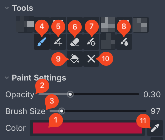
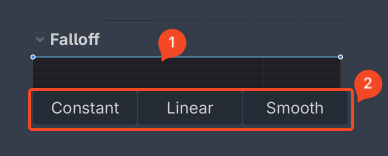
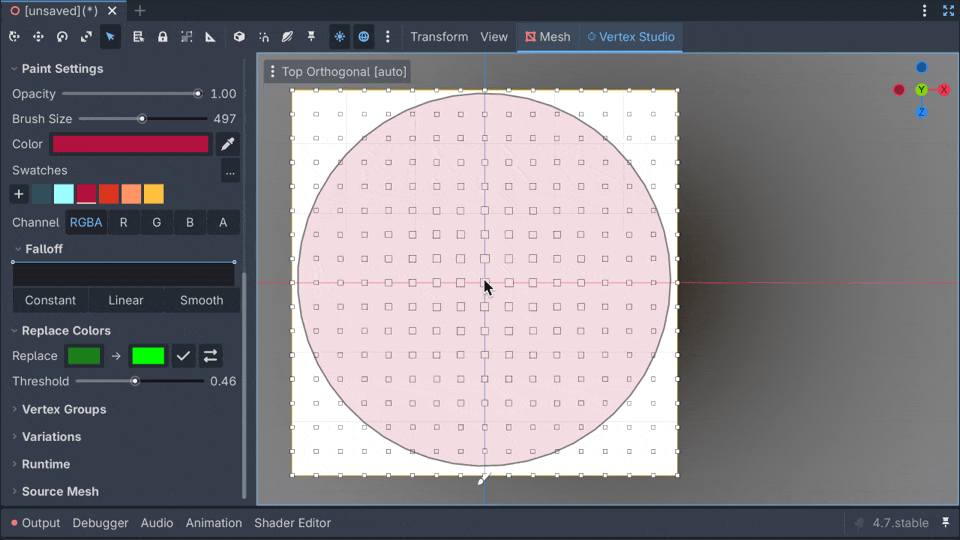
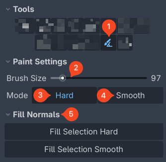
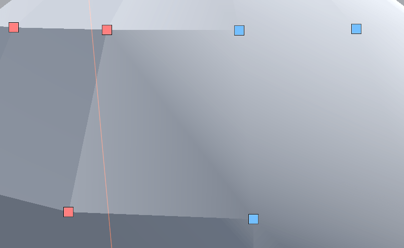
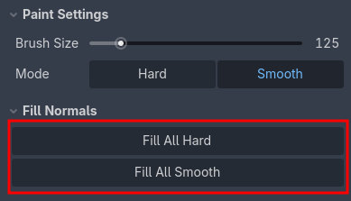
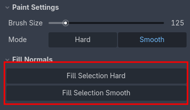

Brushes and Painting Tools
=========================================

Shared Paint Settings
----------------------

1. Color: the current active color to be painted. Click to open Godot's color picker.
2. Opacity: the current active opacity to be painted. All brushes make use of the opacity setting.
3. Brush Size: current brush size / brush radius to cover the viewport. Size in screen pixels (size constant regardless of the viewport's zoom level).

Painting Tools
--------------

4. Paint Brush (:kbd:`B`): the default painting tool. Hold the left mouse button and drag in the viewport to paint.
5. Paint Brush (Additive mode): the same as the Paint Brush, but in additive blending mode.
6. Eraser (:kbd:`Shift+E`): remove color (also affected by the opacity setting).

7. Precision Paint Brush: a point-and-click tool with no brush size that locks onto the exact vertex/point under the cursor, where you can add the color of a single vertex under the cursor to the current active color with the current opacity. If opacity is 100%, the vertex color will be fully replaced by the current active color.

    - Useful when there are big clumps of vertices nearby where you want precision, and especially useful when painting individual vertices in Split Shared Vertices mode, with the Precision Paint Brush you can pick individual vertices of the clump fan:
    .. image:: _static/images/manual/painting-precision.gif

8. Blur Brush: a smoothing brush that nudges each vertex's color under the brush radius toward the average of its 1-ring neighbours (crossing hard-edge seams too), creating soft gradients.

9. Fill All / Fill Selection (:kbd:`G`): fill every vertex or just the active selection.

    - Fill also respects opacity, so filling repeatedly builds the color up.

10. Erase All / Erase from Selection

    - Erase All does not respect opacity, it will completely remove the color of the all vertices or all vertices in the active selection.

11. Color Picker: pick the color of the vertex under the cursor.

Falloff Curves
--------------

Falloff Curves: shape the brush's strength profile with Godot's curves. Different falloff graphs effectively become different brushes and "stamps".

1. Custom falloff curve: click to open Godot's curve editor in the inspector and create a new curve or adjust an existing one.

2. Default falloff presets:

    - Constant
    - Linear
    - Smooth

.. _paint-normals:

Paint Normals
-------------

.. note::
    This feature requires Vertex Studio Pro ⭐.

``Paint Normals`` is a brush that edits vertex normals instead of colors, so you can make edges hard or smooth directly in Godot, without going back to Blender.

With the tool active, ``Paint Settings`` shows a ``Mode`` row:

- ``Hard``: the brushed corners become faceted, each face keeps its own normal.
- ``Smooth``: the brushed corners are averaged, so the edge shades smoothly.

Brush size still applies, opacity and falloff do not: a normal is either hard or smooth, there is nothing in between.

While the tool is active, the vertex squares are colored by their current state instead of their color:

- Light **red** for *hard*.
- Light **blue** for *smooth*.

.. important::
    Painting normals is topological, it changes the mesh: making an edge hard splits the corner into one vertex per face, and making it smooth welds those vertices back into one. Tangents are regenerated afterwards.

    Since a welded vertex can only hold one color and one UV, corners painted with different colors don't fully weld: they keep their separate vertices but shade smoothly.

.. tip::
    Painting normals is also highly related to the :doc:`split-and-merge-shared-vertices` view modes.

Fill Normals
^^^^^^^^^^^^

With the tool active, the panel also shows a ``Fill Normals`` section to set the whole mesh at once:

- ``Fill All Hard`` / ``Fill All Smooth``: apply to every vertex.
- With an active selection the buttons become ``Fill Selection Hard`` / ``Fill Selection Smooth`` and apply only to the selected vertices.

.. video:: _static/videos/paint-normals-smooth-hard.mp4
    :width: 100%

.. tip::
    Use the ``Setup Lit`` material while editing normals (see :doc:`material-setup`). The unlit material shades everything flat, so you won't see the difference between a hard and a smooth edge.

Workflow: from a smooth model to painted hard corners
^^^^^^^^^^^^^^^^^^^^^^^^^^^^^^^^^^^^^^^^^^^^^^^^^^^^^

1. With ``Paint Normals`` in ``Hard`` mode, brush the edges you want faceted (or use ``Fill All Hard`` for a fully faceted look).
2. Switch to ``Split Shared Vertices`` in ``View``. The corners you made hard now fan apart.
3. Pick the ``Precision Paint Brush`` and paint each corner of the fan with its own color.
4. Go back to ``Merge Shared Vertices`` when you are done, so normal painting behaves as usual again.

.. tip::
    Both the merge and split toggle and the normals tool can be bound to a key, see :doc:`shortcuts`.
