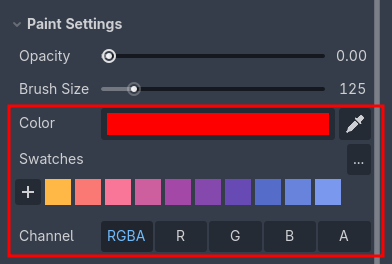
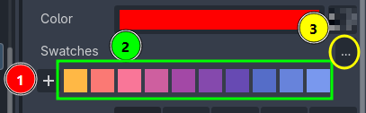
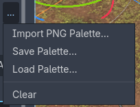
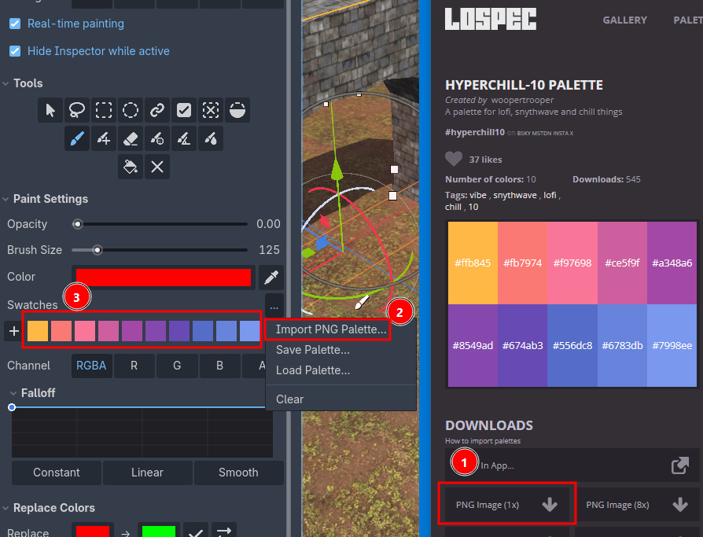

Colors, Swatches and Palettes
=========================================

The active color and the swatches are in ``Paint Settings``, right after the brush settings.

1. Color: the color that is painted. Click it to open Godot's color picker.
2. Eyedropper: click it and then click a vertex in the viewport to sample that vertex's color into the active color.

The brush, the additive brush, the bucket fill and the ``Precision Paint Brush`` all paint with this color.

.. note::
    The eraser does not use the active color, it restores vertices back toward white. The opacity setting controls how hard or soft it erases.

.. tip::
    When a single channel is selected in ``Channel``, the color is ignored and what is painted is the ``Value`` slider instead. See :doc:`rgba-channels`.

Swatches
--------

Swatches are your reusable colors. They are saved between sessions, so the palette you build while painting a scene is still there the next time you open the project.

1. ``+``: add the current color as a swatch.
2. Left-click a swatch to make it the active color, right-click it to remove it.
3. ``...``: the swatch options menu (see below).

You can also cycle through the swatches while painting, without leaving the viewport, by pressing :kbd:`X`. It wraps around at the end of the list. See :doc:`shortcuts`.

Swatch options
--------------

- ``Import PNG Palette…``: read the colors out of a PNG image. Every unique pixel color becomes a swatch, in the order they appear in the image. The PNG does not need to be inside your project. For example, you can import palettes from `Lospec <https://lospec.com/palette-list>`_.
- ``Save Palette…``: save the current swatches as a Godot Resource file.
- ``Load Palette…``: load a palette resource back into the swatches.
- ``Clear``: remove all swatches.

Palette files
-------------

Palettes are plain Godot Resource files, so you can keep them in the project, commit them and reuse them across scenes and projects.

On Godot 4.4 and higher, Vertex Studio saves the engine's own ``ColorPalette`` resource, so the same file can also be loaded in Godot's color picker, and palettes you created there can be loaded here. On older versions Vertex Studio saves its own palette resource instead.
