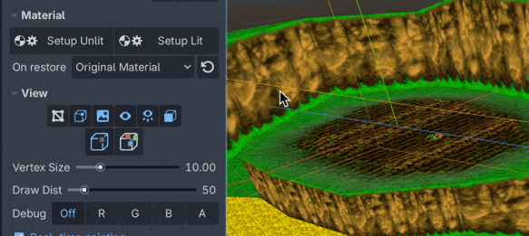
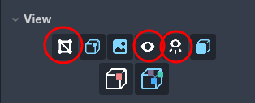
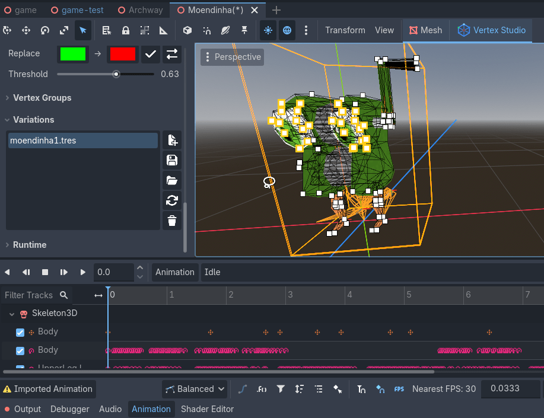
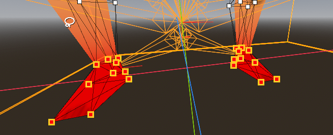
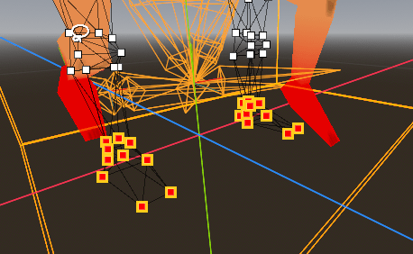
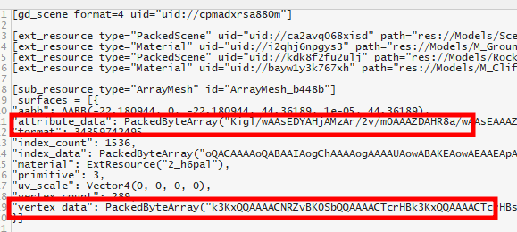

FAQ
=========================================

Is Vertex Studio a standalone application?
---------------------------------------

No, it's a Godot Engine plugin (addon). It requires you to use it in a project inside the Godot editor.

What is the minimum version of Godot required?
---------------------------------------

Godot 4.3 or higher.

My model has a custom shader and custom material, can I use Vertex Studio to paint it?
--------------------------------------------------------------------------------------------

Yes. 

If your custom material (called ``Original Material`` in Vertex Studio) is not applied to your model when you open Vertex Studio, you can click the ``Restore Original Material`` button to apply it again.

.. image:: _static/images/faq-restore-material.gif

The tradeoff of keeping using your custom material while painting is that you won't be able to use Vertex Studio's debug views and view modes (like toggling texture, vertex colors on and off, visualizing different channels, etc.). For that, you can simply click ``Setup Unlit`` / ``Setup Lit`` anytime to switch to the paint material and then re-click ``Restore Original Material`` anytime to switch back to your custom material.

You can do this as many times as you need during the usage of Vertex Studio, and upon closing Vertex Studio (or simply running the project), the original material will be restored automatically.

Is there undo and redo support?
----------------------------------

Yes, undo history is implemented, you can undo and redo normally in Godot.

.. _faq-max-triangles:

What is the maximum amount of triangles per mesh that Vertex Studio can handle?
---------------------------------------------------------------------

From my tests, up until 20k triangles per mesh (plus children meshes) there's barely any noticeable performance impact.

If you have a scene with multiple separate meshes, there's no performance impact at all even if the scene has hundreds of thousands of triangles, since Vertex Studio processes only the currently selected mesh (and its children).

From 20k to 80k triangles in a single mesh, it's still possible to paint and select vertices, but the brush starts to get sluggish.

I even tested painting a mesh with 2.5 million triangles, and Godot nor the addon crashed, but each brush stroke took a few seconds to complete.

When dealing with denser meshes, be sure to disable ``Show Wireframe``, ``Show Vertices`` and ``Always Show Vertices`` under ``View``.

.. _faq-skeletal-mesh:

Can I paint the vertex colors of skeletal/skinned meshes? Can I paint on animated meshes?
--------------------------------------------------------------------------------------------

Yes. Vertex Studio supports both static and skeletal/skinned meshes, even if the mesh is in the middle of an animation.

But if you are going to save selections into variations or vertex groups, it's recommended to make the selection in a neutral pose.

For example, with this Banjo-Kazooie-inspired character, I selected the first frame of the idle animation in the ``AnimationPlayer``, then selected the eyes and saved the selection as a variation:

As another example, I painted that character's feet while it was neutral:

And this is how the selected vertices look like when the character is in another pose. The current limitation is that the vertices always appear in the position of the neutral pose ("floating" away from the mesh). But even if the vertices are "floating", you can still paint them, like here:

.. _faq-vertex-painting-and-model-changes:

What happens when I vertex paint a mesh with Vertex Studio and then update the source model externally (like Blender), does the updated mesh gets the previously painted vertex colors?
------------------------------------------------------------------------------------------------

No. You cannot recover the vertex colors in this case not even with variations, since what you do in Vertex Studio is saved inline in the ``MeshInstance3D`` node, it overrides the mesh data from the external source file (Blender, GLTF, OBJ or FBX file), and by changing the source file, vertex and normal positions might change, which doesn't match the inlined data.

What you do in Vertex Studio is saved inline in the scene file that contains the ``MeshInstance3D`` node:

What happens when I vertex paint a mesh with Vertex Studio and then update the source model externally (like Blender), does the ``MeshInstance3D`` node gets the model changes?
------------------------------------------------------------------------------------------------

No. See :ref:`faq-vertex-painting-and-model-changes` above.