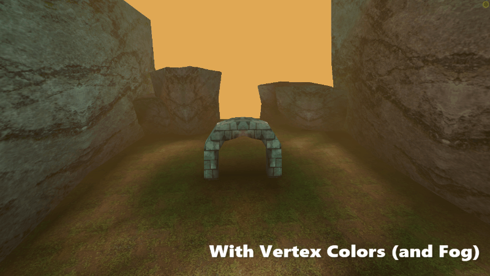

.. Vertex Studio Documentation documentation master file, created by
   sphinx-quickstart on Thu Jul  9 16:12:13 2026.
   You can adapt this file completely to your liking, but it should at least
   contain the root `toctree` directive.

Vertex Studio Documentation
=========================================

Vertex Studio is a Godot plugin for **editing, managing and painting vertex colors and vertex normals** of 3D meshes. A complete solution for vertex painting inside the Godot editor. Vertex Studio is a must-have tool for making games inspired by PS1, N64 or early 2000s PC games aesthetics, but it's useful even in modern workflows, since vertex coloring can also be used for texture blending and masking.

It has tools for:

- Painting and filling vertices (brush, eraser, opacity adjustment, brush falloff, color palettes, bucket fill, blur, color replacement by threshold, individual RGBA channel selection).

   - Supports both static and skeletal/skinned animated meshes.

- Selecting vertices (lasso, rectangle and ellipse selection); linked by material selection (like Blender).
- Changing vertex and face normals between hard and smooth.
- Painting individual vertices or split vertices (shared vertices of hard edges, allowing for multipler colors in a single "physical vertex").
- Grouping vertices into vertex groups like Blender.
- Creating and managing variations/snapshots of vertex colors, selections and vertex smoothness topology, creating non-destructive variations of a single mesh.
- Switching between mesh variations at runtime and blending between variations.

See :ref:`features-details` for detailed information about each feature.
 
.. video:: _static/videos/vertexstudio-features-overview-captioned.mp4
  :width: 100%

Where to get it
----------------

See the :doc:`installation` page.

How to use it
--------------

See the :doc:`quickstart-tutorial` page.

Need help?
----------

See the :doc:`support` page.

.. toctree::
   :hidden:
   :maxdepth: 4
   :caption: Quickstart
   
   features
   installation
   shortcuts

.. toctree::
   :hidden:
   :maxdepth: 4
   :caption: Tutorials and Guides

   quickstart-tutorial
   multi-texture-blending-tutorial
   blending-variations-runtime

.. toctree::
   :hidden:
   :maxdepth: 4
   :caption: Manual

   interface
   material-setup
   view-options
   selection-tools
   brushes-painting-tools
   colors-palettes
   rgba-channels
   replace-colors
   vertex-groups
   variations
   runtime-and-api
   mesh-tools
   merge-and-split-shared-vertices
   settings-and-preferences

.. toctree::
   :hidden:
   :maxdepth: 4
   :caption: Support
   
   faq
   troubleshooting
   support
   license
   about