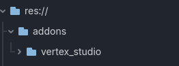
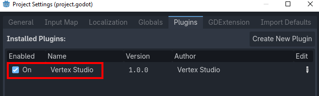
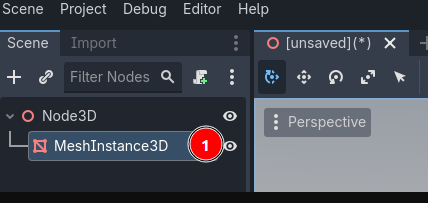
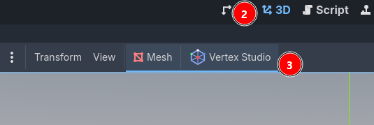

Installation
=========================================

Download and extract
------------------------------

- Download Vertex Studio from the Godot Asset Store (Free version) or from itch.io (Free and Pro versions). (TODO: ADD LINKS)
- Extract the zip file
- If you already have addons in your Godot project, move ``addons/vertex_studio`` into your ``addons`` folder, otherwise move the whole ``addons`` folder into your Godot project.

.. note::	
    Vertex Studio requires **Godot 4.3 or higher**.

Activate the addon
------------------

In Godot, go to "Project > Project Settings... > Plugins" and enable "Vertex Studio".

Open the addon
--------------

Now, anytime you click on a ``MeshInstance3D`` in the Scene Tree and you activate the 3D Workspace, the Vertex Studio button will be available in the toolbar.

Click the button to open Vertex Studio.

.. thumbnail:: _static/images/installation-activate-addon.png
