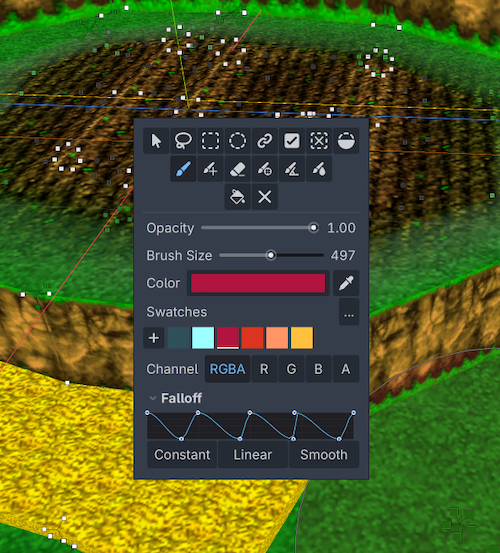

Interface
=========================================

.. list-table::
   :widths: 50 50
   :header-rows: 0
   :class: interface-overview

   * - .. thumbnail:: _static/images/manual/interface.png
          :width: 80%
          :align: center
     - #. :doc:`material-setup`
       #. :doc:`view-options`
       #. :doc:`selection-tools`
       #. :doc:`brushes-painting-tools`
       #. :doc:`colors-palettes`
       #. :doc:`rgba-channels`
       #. :doc:`replace-colors`
       #. :doc:`vertex-groups`
       #. :doc:`variations`
       #. :doc:`runtime-and-api`
       #. :doc:`mesh-tools`

In Godot's 3D Viewport, while Vertex Studio is active, press :kbd:`Ctrl+F` (Mac: :kbd:`Cmd+F`) to open the tools popup at the cursor position:

