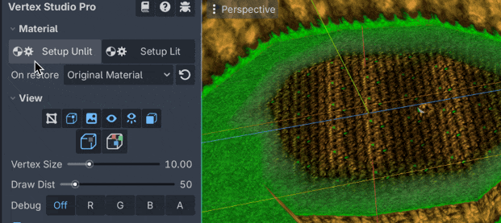
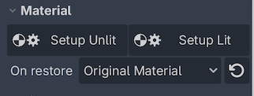
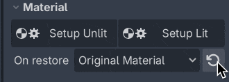
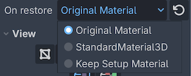

Material Setup
=========================================

Vertex Studio operates on the mesh data, this way, it doesn't impose the usage of any shader. The mesh can have any shader and material. Of course, if you want to use the vertex color information in any way, your shader must use that information somehow (like showing the colors themselves or using the colors for something else, like :doc:`blending textures <multi-texture-blending-tutorial>`).

But in order to make it easy to use Vertex Studio, Vertex Studio provides a two default materials, called ``Setup Materials``. These materials use the shaders that come in the ``shaders`` folder of the addon (you don't have to worry about the shaders, setup is automatic, see below).

See the related FAQ: :ref:`faq-custom-shader-and-material`.

.. warning::
    Make sure your mesh has at least one material assigned before using Vertex Studio, otherwise not even Vertex Studio's setup materials will be applied. If for example you use one of Godot's procedural meshes (like the Plane, Cube, Torus, etc.), you need to manually assign a material to the mesh before being able to paint the vertex colors with Vertex Studio.

    .. image:: _static/images/tut-torus-mesh.png
    .. image:: _static/images/vertex_studio_godot_troubleshooting-8.jpeg

Setup Material features
--------------------------------

- Automatically grabs the textures from the original material of the mesh.

    - It also uses the same sampling (texture filtering such Linear, Nearest, etc.) as the original material.

- Displays vertex colors.
- Contains code that allows the usage of Vertex Studio's :doc:`debug views and view options <view-options>`.
- Two variations: Unlit (unshaded and no shadows, uses the shader ``shaders/vertex_studio_unlit.gdshader``) and Lit (uses the shader ``shaders/vertex_studio_lit.gdshader``).

    - By using the Lit material you can correctly visualize smooth and hard surfaces.

Setup Material usage
--------------------------------

Click the ``Setup Unlit`` and ``Setup Lit`` buttons to switch between the two materials. You can click them anytime, as many times as needed during the usage of Vertex Studio.

Original Material
--------------------------------

If you want to view the mesh's original material and shader, you can click the ``Restore Original Material`` button. You can alternate between the original material and the setup materials anytime, simply by clicking the buttons.

On restore options
--------------------------------

- ``Original Material``: restores the mesh's original material and shader (i.e. your custom material and shader).
- ``StandardMaterial3D``: applies Godot's StandardMaterial3D to the mesh with ``Vertex Colors: Use as Albedo`` enabled.
- ``Keep Setup Material``: persist the setup material into the mesh, even after closing Vertex Studio.

Automatically restoring the original material
--------------------------------

Upon closing Vertex Studio (or simply running the project), the material specified in ``On restore`` is restored automatically, so you don't have to worry about manually restoring the original material or switching Vertex Studio's setup materials on and off.