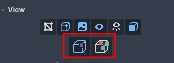
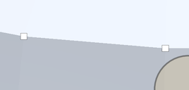
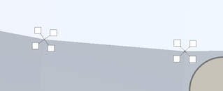

Merge and Split Shared Vertices
=========================================

What shared vertices are
------------------------

On a smooth surface, the faces around a corner share one single vertex. On a hard edge they can't: each face needs its own normal at that corner, so the mesh stacks several vertices in the exact same position, one per face. They are shared in the sense that they sit at the same place, and each one carries its own normal and its own color.

That detail matters for vertex painting, because a "physical vertex" you see in the viewport can actually be two, three or more vertices on top of each other, and each one can hold a different color.

Vertex Studio gives you both behaviours, and you switch between them in the ``View`` section (see :doc:`view-options`).

.. tip::
    You can alternate between a hard and a smooth edge by using the ``Paint Normals`` brush, see the :ref:`paint-normals` brush.

Merge Shared Vertices
---------------------

The default mode: vertices stacked in the same position are painted together and drawn as a single square, so a corner reads as one vertex and gets one color ("one physical vertex, one color").

Split Shared Vertices
---------------------

.. note::
    This mode requires Vertex Studio Pro ⭐.

The stacked vertices fan apart on screen around their real position, each square drawn in its own color with a thin line back to the point they belong to. Now you can paint each face's corner with a different color, which is how you get a sharp color change across an edge instead of a gradient, the classic N64 and PS1 look.

The fan is only for picking, the vertices never move: as soon as you go back to Merge, the squares collapse back into one.

.. tip::
    The ``Precision Paint Brush`` is the comfortable way to paint a fan, it locks onto the individual vertex under the cursor with no brush size involved. See :doc:`brushes-painting-tools`. If you want to paint all vertices on the fan at once, just use the brush, normally.

.. tip::
    Selection tools can select individual vertices on the split fan.

.. note::
    Split only has something to fan out where the mesh actually has hard edges. On a fully smooth model every corner is a single vertex, so both modes look the same. To create the hard edges, use the ``Paint Normals`` brush, see the :ref:`paint-normals` brush.

