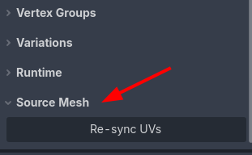
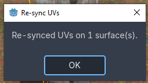
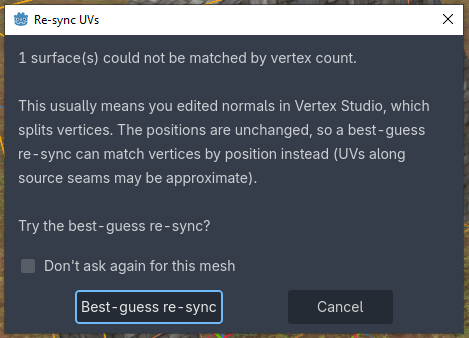

Mesh Tools
=========================================

Tools that work on the mesh as a whole, instead of on colors or selections, in the ``Source Mesh`` section, at the bottom of the panel.

Re-sync UVs
-----------

.. note::
    This feature requires Vertex Studio Pro ⭐.

When you paint a mesh, Vertex Studio saves the result inline in the scene file, which means the ``MeshInstance3D`` stops using the mesh from the model file and uses its own copy instead (see :ref:`the FAQ <faq-vertex-painting-and-model-changes>`). From that moment on, if you go back to Blender and tweak the UVs, the re-imported model no longer reaches the painted node.

``Re-sync UVs`` reads the source model again and copies the UVs (``UV``, ``UV2`` and the tangents) into your painted mesh, keeping everything Vertex Studio edited: vertex colors, normals and positions.

1. Edit the UVs in your 3D application and save the model, Godot re-imports it as usual.
2. Select the ``MeshInstance3D`` that you painted in Vertex Studio, expand ``Source Mesh`` and click ``Re-sync UVs``.
3. A summary tells you how many surfaces were re-synced and how many were skipped (if any).

Vertex Studio finds the source model on its own, either from the inherited scene the mesh came from or from a model ancestor in the scene. If it can't figure it out, it asks you to pick the model file (``glb``, ``gltf``, ``blend``, etc).

.. important::
    Only the UVs and the tangents come back from the source model. Geometry changes (new vertices, moved vertices, a different triangle count) are not brought back, and that is not something that can be recovered, at least in the current implementation, see :ref:`the FAQ <faq-vertex-painting-and-model-changes>`.

When the vertex counts don't match
^^^^^^^^^^^^^^^^^^^^^^^^^^^^^^^^^^

The exact re-sync matches vertices by index, which only works while your mesh and the source model still have the same number of surfaces and the same vertex count per surface. That is the normal case after a UV-only edit.

The counts differ when the painted mesh has more vertices than the source, which usually means you created hard edges with the ``Paint Normals`` brush (a hard edge splits a vertex into one per face, see :doc:`merge-and-split-shared-vertices`).

In that case Vertex Studio offers a best-guess re-sync:

Since editing normals never moves a vertex, the best guess matches vertices by **position** instead of by index: each vertex takes the UV of the source vertex sitting at the same place, and split corners all inherit that one UV. Where the source has a UV seam (several UVs at the same position) it picks the one closest to the vertex's current UV, so a moderate UV move still lands on the right side of the seam.

It is a guess, not an exact mapping, so check the result. If it went wrong, undo with :kbd:`Ctrl+Z`.

- ``Don't ask again for this mesh``: check it and the best guess runs directly on the next re-sync of that mesh, with no dialog. It's remembered in ``res://.vertex_studio/prefs.cfg`` and keyed by the scene plus the mesh name, so renaming the node or moving the scene makes it ask once more.
- Surfaces with no counterpart in the source model are skipped and reported in the summary.
