Multi-texture blending with vertex colors
=====================================================================

Vertex colors are not used only in retro-styled games, they can also be used to store weights that can be used for all kinds of things in shaders, such as blending multiple textures. By painting vertex colors in the separate RGBA channels, you can use the value from ``0.0`` to ``1.0`` from these channels as weights to blend textures.

Vertex Studio supports painting in the separate RGBA channels, either individually or additively. See :doc:`rgba-channels`.

Blending between two textures by painting in the ``A`` (Alpha) vertex color channel:

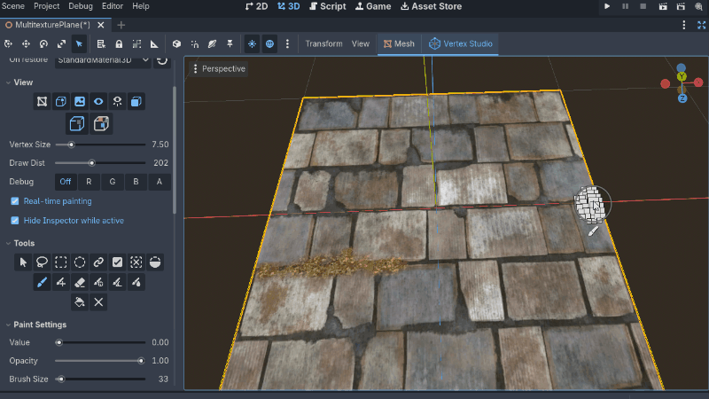

In this Banjo-Kazooie segment from the Spiral Mountain level that I recreated in Godot, you can see the grass blends with the field texture from a value that comes from the ``A`` channel. The grass itself is also painted with vertex color in the ``RGB`` channel. So, this is an example of having both the texture blending and vertex colors used together (`Banjo-Kazooie did this extensively in all levels <https://alfredbaudisch.com/experiment-logs/banjo-kazooie-n64-environments-and-levels-texture-blending-and-vertex-color-usage/>`_):

.. thumbnail:: _static/images/textureblending-intro-bk.png
   :alt: Banjo-Kazooie texture blending

.. note::
    This tutorial requires Vertex Studio Pro ⭐.

Sample project
--------------

If you want, you can download the complete sample project from `GitHub <https://github.com/alfredbaudisch/GodotVertexStudio_Tutorial/archive/refs/heads/master.zip>`_. Extract the zip file and open the project in Godot.

- Files relevant to this tutorial are in the folder ``Advanced/MultitextureBlending``.
- You can paint the same plane painted in the previous image, it's the scene ``Advanced/MultitextureBlending/MultitexturePlane.tscn``.

.. note::
    If you already download the sample project from the :doc:`quickstart-tutorial`, it's the exact same project.

Shader and material setup
------------

Blending textures is not something that is part of Vertex Studio, and Vertex Studio does not limits what you can do with vertex colors and does not impose that you use this or that shader or material. Instead, you can use any custom shader and material, since vertex colors live in the mesh itself. Then, you can use the vertex color information in any shader, in any way you want.

Let's create the shader that allows for the effects showed in the images above. It's a pretty simple shader that mixes two textures, where the mix weight/blend factor comes from the vertex color alpha channel (``A``). Then the shader multiplies the final color with the vertex colors.

1. Create a new Resource and choose ``VisualShader``.

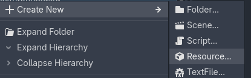

2. In the visual shader editor, select ``Fragment`` on the top menu.

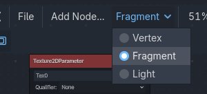

3. Then add the following nodes:

.. thumbnail:: _static/images/textureblending-shader-nodes.png
   :alt: Multi-texture blending shader

4. Create a new Resource and choose ``ShaderMaterial``. Double-click the material, and in the inspector, drag the Resource file of the shader that you created previously into ``Shader`` and assign the texture ``Tex0`` to ``Tex1``.

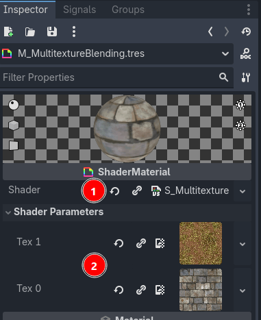

.. note::
    In the sample project the shader is the file ``S_MultitextureBlending.tres`` and the material is the file ``M_MultitextureBlending.tres``. The sample material uses textures from the folder ``res://Models/Textures/``.

Assign the material to the mesh
------------------------------

1. Assign this material to a mesh. In the sample project, it's assigned to the high poly plane mesh from ``MultitexturePlane.glb`` in the mesh import settings (double click the source file, go to ``Materials`` and enable ``Use External`` for the only available material, and then select the material file).

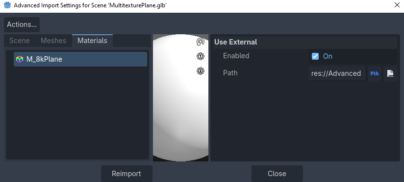

2. Right-click the ``GLB`` and choose ``New Inherited Scene`` (or just open the sample file ``MultitexturePlane.tscn``).

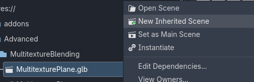

Painting in the Alpha (A) channel
--------------------------------

1. Open the scene, click the ``Plane`` node and activate Vertex Studio. 

.. note::
    If you recall from the :doc:`quickstart-tutorial`, the first step was to click ``Setup Unlit`` to setup the mesh to use Vertex Studio's special painting material. But this time we want to keep using our custom material in order to see the texture blending in action as we paint.

    In ``Material > On restore`` make sure the value is ``Original Material`` and then click the restore button.

    .. image:: _static/images/textureblending-paint-00-material.png

2. Select the ``Brush`` (:kbd:`B`), and after ``Swatches``, select the ``A`` channel.

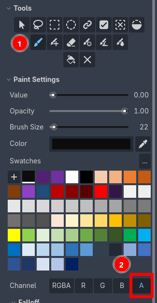

3. When painting in these separate channels, the color is not important. What is important is how you adjust the ``Value`` and the ``Opacity`` sliders. 

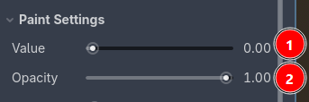

- ``Value`` dictates the weight from ``0.0`` to ``1.0``.
- ``Opacity`` is how strong are you applying the valor.

Then it's up to your shader to use this information in whatever way. In the case of the sample shader, the vertex color (1) is broken down into its separate RGBA channels, and then the alpha channel (2) is used as the weight of the ``Mix`` node (3):

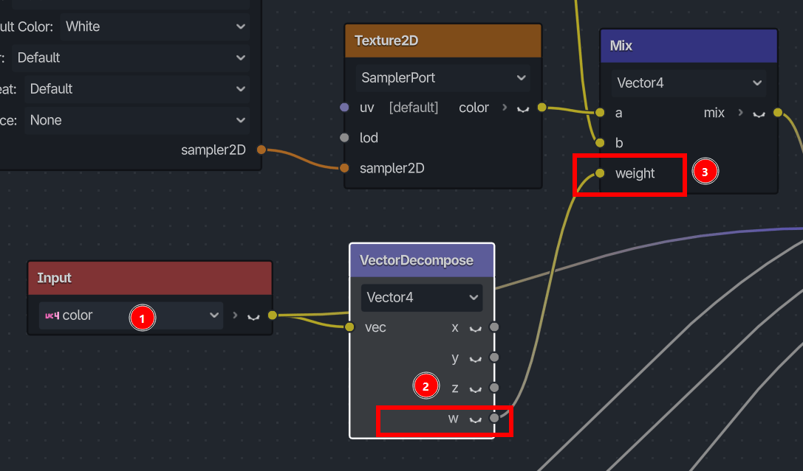

.. note::
    In the end, the ``Value`` slider is also technically a color, it represents a grayscale value range, where ``0.0`` is pure black and ``1.0`` is white.

4. Now, just paint as you like. You can adjust the ``Opacity`` and the brush size (:kbd:`[` and :kbd:`]` in the viewport) to create even more blending and variation. You can also use the ``Eraser`` (:kbd:`Shift+E`) to remove parts of the painting, and with it in low opacity, you can create subtle transitions.

.. tip::
    Vertex Studio supports painting in the Godot 3D viewport both in Perspective and Orthographic views.

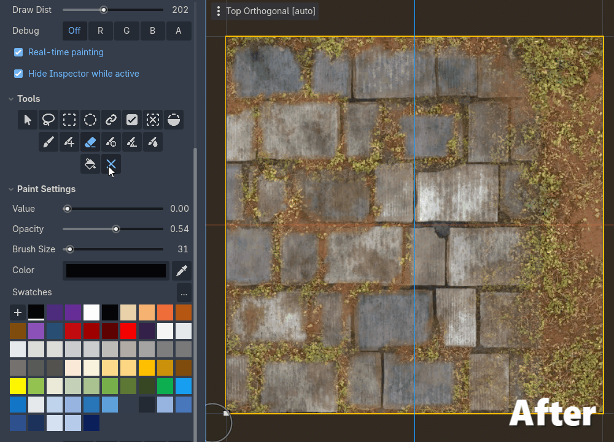

Visualizing the Alpha channel
------------------------------

To visualize the what is currently painted in the separate channels, you can use the debug view modes of the Vertex Studio ``Setup Material``.

.. video:: _static/videos/textureblending-viewmodes.mp4
  :width: 100%

1. Go to ``Material`` and click ``Setup Unlit``.

2. In ``View > Debug`` click ``A`` to visualize the alpha channel.

3. If you want to see your material back, in ``Material > On restore`` make sure the value is ``Original Material`` and then click the restore button.

4. You can alternate between the setup material and your material as many times as needed.

Using vertex colors on top of the texture blending
--------------------------------------------------

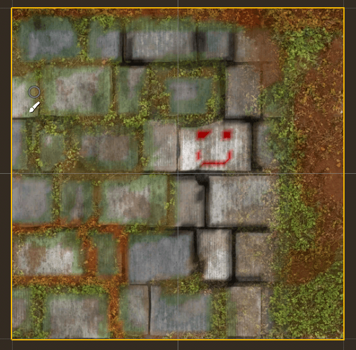

Our shader multiplies (1) the vertex colors (2) with the final color that comes out of the texture blending (3). So it supports adding the vertex colors on top of the textures.

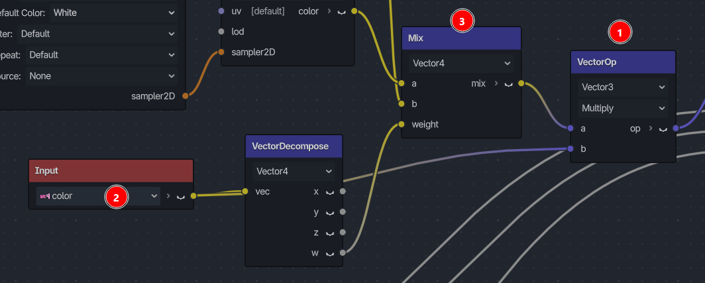

.. video:: _static/videos/textureblending-painting-colors.mp4
  :width: 100%

1. After ``Swatches``, in ``Channel``, select the ``R`` channel, hold :kbd:`Shift` and click the ``G`` and the ``B`` channels, now, the ``R`` + ``G`` + ``B`` channels are selected additively and painting will affect all three channels at once.

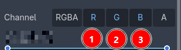

.. note::
    Why not click the ``RGBA`` button to select all channels at once? Because we already painted in the ``A`` channel. If we paint in the ``RGBA`` channel, it will override what we have painted previously in the ``A`` channel.

    .. image:: _static/images/textureblending-channels-rgba.png

2. Now, paint as you like. Notice how the color goes on top of the blended textures. If you erase, use the ``Fill Tool`` or ``Erase All Tool``, they are going to affect only the selected channels.

3. You can inspect the colors painted. Like before, go to ``Material`` and click ``Setup Unlit``, in ``View > Debug`` click ``Off`` to visualize all channels at once or click ``R`` or ``G`` or ``B`` or ``A`` to visualize the colors and values in each channel.

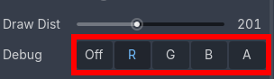