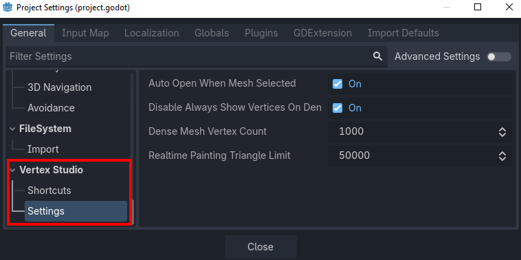
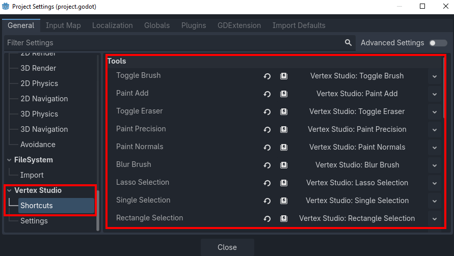

Project Settings
=========================================

Vertex Studio adds its own section to **Project > Project Settings > General**, with two sub-sections:

- **Settings**: behaviour and performance options, explained below.
- **Shortcuts**: the keybinding for every tool and action, see :doc:`shortcuts`.

Everything here is stored in the project's ``project.godot``, so the settings belong to the project (and to version control). Each entry has Godot's usual revert arrow to bring the default back.

.. note::
    These are project-wide options. The per-mesh and per-session options (view modes, brush, colors, palettes, and so on) live in Vertex Studio's own panel, see :doc:`view-options` and :doc:`brushes-painting-tools`.

Settings
--------

Auto Open When Mesh Selected
~~~~~~~~~~~~~~~~~~~~~~~~~~~~

Default: **on**.

With this on, once you open Vertex Studio it stays open while you select other ``MeshInstance3D`` nodes, which is what you want when you are painting a whole scene.

With it off, the panel only reopens for the meshes you were painting: Vertex Studio remembers, per mesh, whether you left the panel open (the toolbar toggle is what marks it), and selecting a mesh you never opened it on keeps the panel closed. Handy in scenes full of ``MeshInstance3D`` nodes where only a couple of them are vertex painted.

That per-mesh memory is kept in ``res://.vertex_studio/prefs.cfg``, so it survives closing Godot.

Disable Always Show Vertices On Dense Meshes
~~~~~~~~~~~~~~~~~~~~~~~~~~~~~~~~~~~~~~~~~~~~~

Default: **on**.

Drawing one square per vertex is the most expensive part of the overlay, and **Always Show Vertices** pays that cost the whole time, even with no tool active. So when the selected mesh has at least *Dense Mesh Vertex Count* vertices, Vertex Studio switches Always Show Vertices off for you.

The setting is an automatic override: your own value comes back as soon as you select a lighter mesh, and if you turned ``Always Show Vertices`` back on in the meantime, your click wins. See :doc:`view-options` for both options.

.. note::
  :doc:`Show Vertices <view-options>` has its own higher threshold, see *Disable Show Vertices On Very Dense Meshes* below: it only draws while you are actually using a tool.

Dense Mesh Vertex Count
~~~~~~~~~~~~~~~~~~~~~~~

Default: **1000** vertices (minimum 100).

The vertex count at which a mesh counts as "dense" for the option above.

Disable Show Vertices On Very Dense Meshes
~~~~~~~~~~~~~~~~~~~~~~~~~~~~~~~~~~~~~~~~~~~

Default: **on**.

Past *Very Dense Mesh Vertex Count* vertices Vertex Studio switches Show Vertices off.

Very Dense Mesh Vertex Count
~~~~~~~~~~~~~~~~~~~~~~~~~~~~

Default: **250,000** vertices in the GDExtension edition, **20,000** in the GDScript one.

The vertex count at which a mesh counts as "very dense" for the option above. Lower it if the vertex cloud is costing you frames on your machine, increase it if your machine handles more than the default.

Realtime Painting Triangle Limit
~~~~~~~~~~~~~~~~~~~~~~~~~~~~~~~~

Default: **50000** triangles.

Every brush dab rebuilds the ``MeshInstance3D`` data, which is what makes painting a heavy mesh stutter, and ``Hide Inspector while active`` tries to help with that, but that helps up to a point.

Past this setting triangle count Vertex Studio ignores the panel's **Real-time painting** option and waits for the mouse release to rebuild.

See the performance options in :ref:`performance-options`.

Shortcuts
---------

Every tool and action of Vertex Studio is bindable here, grouped by category (Tools, Actions, View, Material, Mesh Tools and Brush). Most of them ship unbound on purpose, to stay out of the way of Godot's own 3D viewport shortcuts.

The default keys, the full list of bindable actions and how to rebind them are all in :doc:`shortcuts`.

Async Fill Normals Vertex Count
-------------------------------

Default: **100000**.

``Fill All Hard`` and ``Fill All Smooth`` have to touch every vertex of the mesh, which can freeze the editor on dense meshes. At or above this vertex count, Vertex Studio runs the fill in the background (off the main thread).

See :ref:`gdextension-normals-performance`.

Show Mesh Statistics In Panel
-----------------------------

Default: **off**.

Adds a **Targets** section at the top of the panel with the number of meshes, vertices and triangles of the current selection, plus how many vertices are selected, and the ``Include Children`` checkbox.

Where Vertex Studio stores things
---------------------------------

.. list-table::
   :widths: 40 60
   :header-rows: 1

   * - File
     - What it holds
   * - ``project.godot``
     - The Project Settings above, plus every shortcut binding. Commit it.
   * - ``res://.vertex_studio/scene_data.cfg``
     - Per-mesh data: vertex groups, variation history and the original material overrides. This is project data, commit it.
   * - ``res://.vertex_studio/prefs.cfg``
     - Panel preferences: brush and color settings, palettes, which panel sections are expanded, which meshes had the panel open, and the "don't ask again" answers of the Re-sync UVs dialog. Per user, so you can leave it out of version control.
