Quickstart Tutorial
=========================================

This is a how to use / quickstart guide / tutorial to get you started with Vertex Studio, a Godot plugin.

What is Vertex Studio?
----------------------

See the :doc:`features` page for more details.

Final result
---------------------------------------

Here's a preview of before and after the tutorial. It's the same models with the same textures, without vertex colors and with vertex colors applied, without lighting, since the materials here are unshaded.

.. image:: _static/videos/vertexstudio-final-result.gif

Project and addon setup
-----

If you want to follow along with the tutorial, you can download the sample project here. Extract the zip file and open the project in Godot. (TODO: ADD LINKS)

Then, download and activate the addon in your Godot project (the sample project does not come with the addon). See the :doc:`installation` page for more details.

Material setup
---------------------------------------

Let's start by setting up the material with the material provided by Vertex Studio (it's not required, but it's allows you to toggle between different debug views).

.. video:: _static/videos/vertexstudio-tutorial01.mp4
  :width: 100%

1. Open the "Scenario" scene and click the "Archway" node in the SceneTree.
2. Activate Vertex Studio.
3. Setup the :doc:`Vertex Studio material <materials>` by clicking the ``Setup Unlit`` under the ``Material`` secton. We are choosing the unlit material because we do not want lighting or shadows affecting the viewport and the mesh.

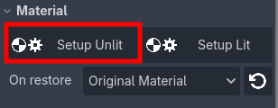

.. note::	
    What happens with the material originally assigned to the mesh? Vertex Studio will automatically restore the material once the interface is closed. You can also restore it immediately by clicking the ``Restore Material`` button (the one with the counterclockwise arrow icon).
    
    You can alternate between the original material and the setup materials any time by clicking the buttons as needed. This workflow is actually encouraged to visualize between the Studio and the final result.

.. warning::
    Make sure your mesh has at least one material assigned. If for example you use one of Godot's procedural meshes (like the Plane, Cube, Torus, etc.), you need to manually assign a material to the mesh before being able to paint the vertex colors with Vertex Studio.

    .. image:: _static/images/tut-torus-mesh.png
    .. image:: _static/images/vertex_studio_godot_troubleshooting-8.jpeg

Basic vertex painting with the brush and the eraser
---------------------------------------------------------------------------

1. Select the ``Paint Vertex Colors`` tool (or simply "Brush Tool") by clicking its icon, pressing :kbd:`B`, or by opening the tools popup in the viewport with :kbd:`Ctrl+F` and clicking the Brush icon.

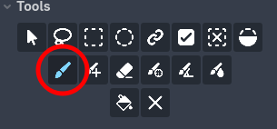

2. Select a color, reduce the opacity, and paint the inner part of the archway.

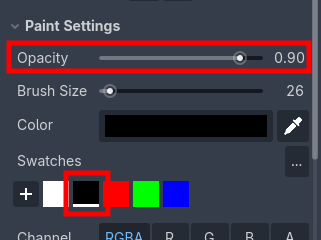

3. In the viewport, you can increase and decrease the brush size by holding :kbd:`]` and :kbd:`[` respectively. You can also cycle through colors from the palette (Swatches) by pressing :kbd:`X` (or also open the tools popup with :kbd:`Ctrl+F`, but from now on, I'm not going to repeat this information).

4. If you make a mistake, you can undo normally or use the ``Eraser`` tool by clicking its icon or by pressing :kbd:`Shift+E`. The eraser is also a brush, thus opacity also affects how hard or soft the eraser is.

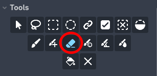

Vertex selection and bucket fill
---------------------------------------------------------------------------

.. video:: _static/videos/vertexstudio-tutorial02.mp4
  :width: 100%

I want to make the base of the archway darker. Let's select the base vertices and fill them with a darker color.

1. In order to make it easier to view vertices that are on the back, disable ``Show Front Verts Only`` under ``View`` (1).

You can also toggle the texture with ``Show Textured`` (2) in order to make it easier to see just the vertex colors.

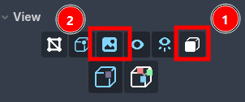

2. To paint only a few selected vertices without affecting unwanted vertices, you can use the ``Single Selection`` tool. Click individual vertices to select them. To **add to the selection**, you can hold :kbd:`Shift` while clicking. To **remove from the selection**, you can hold :kbd:`Alt` while clicking previously selected vertices.

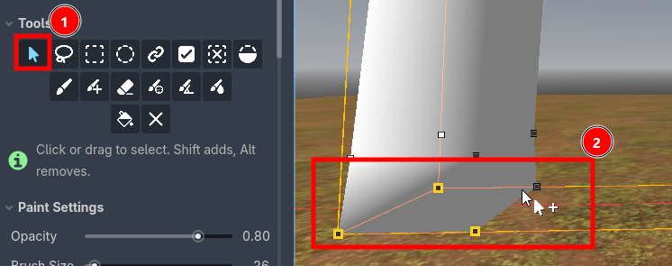

3. You can fill the selected vertices with the ``Fill Selection`` (aka "Bucket Fill", also activated with :kbd:`G` key) (1) tool or you can paint the selected vertices with the brush (since now there's an active selection, the other vertices will be masked out). The bucket fill also uses the opacity setting, so filling repeteadly will add the color to the selection.

If you want, you can first ``Erase from Selection`` (2) to clear the colors from the selected vertices, and then fill again.

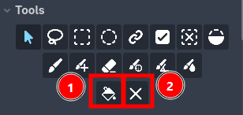

.. note::	
    When there is no active selection, the bucket fill tool is shown as ``Fill All`` and the clear tool is shown as ``Erase All``, and both affect all vertices (i.e. fill all vertices with the current color or erase color from all vertices).
 
4. To clear the selection, you can click ``Deselect`` or press :kbd:`Shift+L` or click an empty space in the viewport.

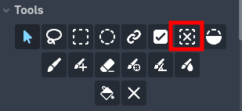

5. PRO ONLY: You can also use the ``Lasso Selection`` (activated with :kbd:`L` key), ``Rectangle Selection`` or ``Ellipse Selection`` tools to select vertices in an easier and more efficient way than the ``Single Selection`` tool. :kbd:`Shift` and :kbd:`Alt` also work to add to or remove from the selection with these tools.

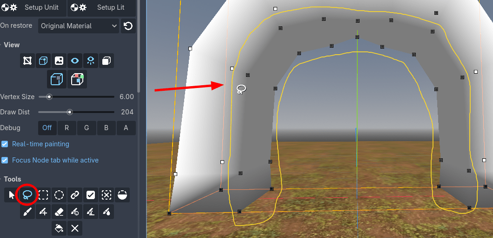

.. note::	
    DEVELOPER NOTE: The lasso tool is one of my favorite tools in the addon, even though it's not the main selling point (which is "painting vertices"), but it's one of the most useful tools when dealing with complex scenes and models (alongside ``Vertex Groups`` and painting individual ``Split Shared Vertices``), since it saves so much time by allowing for complex and weirdly shaped selections.

Color swatches and palettes
---------------------------------------------------------------------------

Let's add some more colors to the archway, from our a custom palette.

.. video:: _static/videos/vertexstudio-tutorial03.mp4
  :width: 100%

1. In the main panel or the tools popup, you can click the main color row to open the color picker. After you choose a color, you can click the ``+`` button to **add the color as a reusable swatch**. To remove a color, **right click a swatch**.

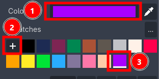

2. You can import colors from PNG images by clicking the ``...`` button at the right side of "Swatches" and choose ``Import PNG Palette...``. For example, you can import palettes from Lospec (https://lospec.com/palette-list). Note that the PNG does not need to be in the project folder.

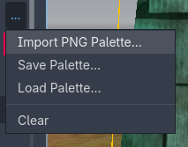

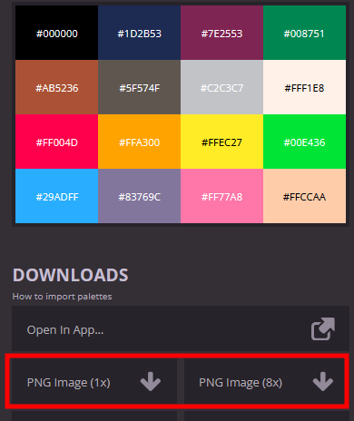

3. After you add your own swatches or import from an external file, you can save the palette as a Godot Resource file by clicking the ``...`` button and choosing ``Save Palette...``. Afterwards, you can load these reusable palettes by choosing ``Load Palette...``.

Brush falloff and big areas
---------------------------------------------------------------------------

Let's paint the ground mesh, and learn how to cover a big area and paint a pattern or a "stamp" with different "brushes" using different brush falloff graphs.

.. video:: _static/videos/vertexstudio-tutorial04.mp4
  :width: 100%

1. In Godot's ``Scene Tree``, click the ``Ground`` node.

2. Since the intention is to cover a big area, let's hide the vertices so it's not too busy in the viewport. Under ``View``, toggle ``Always Show Vertices`` off. Now, vertices will only ve visible under the cursor or when selected.

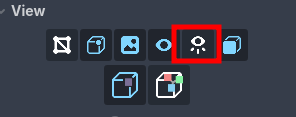

3. Zoom out the viewport and change the view to ``Top Orthogonal`` (:kbd:`7`). 

4. Select the brush and paint the ground as you please.

5. PRO ONLY: What if you want to paint different patterns? What about covering the whole mesh at once with a different brush? There aren't other brush types, but the effect can be achieved by using different brush falloff graphs.

In ``Paint Settings`` expand the ``Falloff`` section and click the graph. Create a different falloff graph curve by clicking and dragging the points (this is the standard Godot's curve editor). After that, increase the brush size to cover the whole ground mesh and "stamp" the pattern.

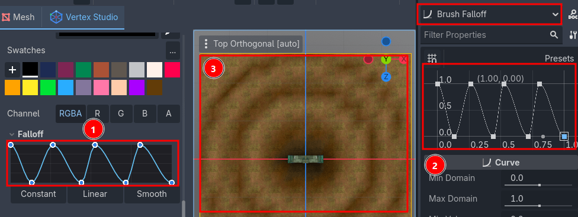

6. Finish by painting a fake shadow and ambient occlusion for the archway on the ground.

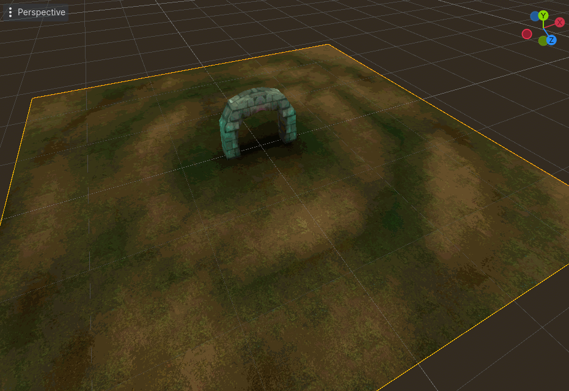

Base mesh and world instances
---------------------------------

Let's create a basic level with multiple instances of the "Rock" mesh and learn how to paint the base mesh and the world instances separately.

.. video:: _static/videos/vertexstudio-tutorial06.mp4
  :width: 100%

1. Create a new Godot scene, call it "RockLevel".

2. Add an instance of the "Scenario" scene that we painted before.

.. note::
    If you click a ``MeshInstance3D`` in the Scene Tree and Vertex Studio opens, you can just click "Vertex Studio" in the 3D Viewport toolbar to close it.

3. Now, add multiple instances of the "Rock" mesh to the scene, translating and scaling them to cover the whole level.

.. note::
    Remember that you can duplicate a scene in the Scene Tree by right clicking it and choosing "Duplicate" or by pressing :kbd:`Ctrl+D`.

.. video:: _static/videos/vertexstudio-tutorial07.mp4
  :width: 100%

4. Open the "Rock" base scene (click its ``Open in Editor`` button in the Scene Tree) and paint the bottom part of it with black, to create the effect of ambient occlusion, and save it.

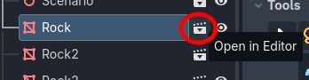

5. Go back to the "RockLevel" scene and notice that all instances of the rock were updated automatically with the vertex colors that you painted in the base scene. 

.. note::
    If you any of your rock instances were not updated with your changes from the base mesh, it means that this world instance already has embedded mesh and vertex data overriden (i.e. you probably edited this specific instance with Vertex Studio).
    
    If you want to revert back to the base mesh, you have to either delete the instance from the Scene Tree and add a new instance or use ``Variations`` (see next section).

6. Now, paint additional shadows and details in the world instances of the "Rock" scene. Instead of opening the "Rock" scene, paint directly in the "Rock" nodes in the Scene Tree of the "RockLevel" scene.

.. note::
    When you paint a mesh with Vertex Studio, the changes are saved in the scene file which is currently active in Godot's 3D Viewport. That means painting these world instances affect only the instances in the current scene, since the mesh data and vertex data is inlined in the scene file.
    
    If you want to paint the base scene (base mesh), you must always open the base scene first, as instructed in step 4.

    .. image:: _static/images/tut-mesh-data.png

7. If you want, you can enable ``Editable Children`` in the "Scenario" scene, select the ``Ground`` node and paint shadows where there are rocks. This is also not going to affect the ``Ground`` base scene, only this specific instance in the "RockLevel" scene.

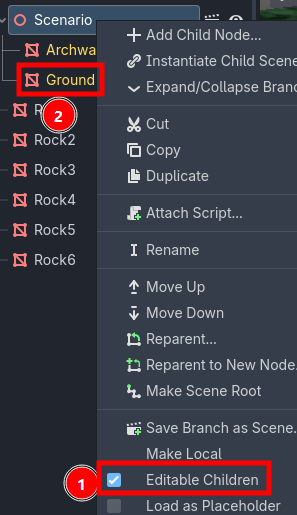

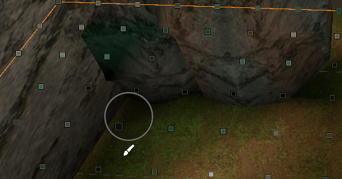

Non-destructive workflow with Variations (PRO ONLY)
-----------------------------------------

The previous workflow is destructive for the local/world instances, which means that if you ever vertex paint a local/world instance, you will not be able to revert back to the base mesh anymore in that specific instance. This is fine in most cases for details specific to meshes in level design, for example.

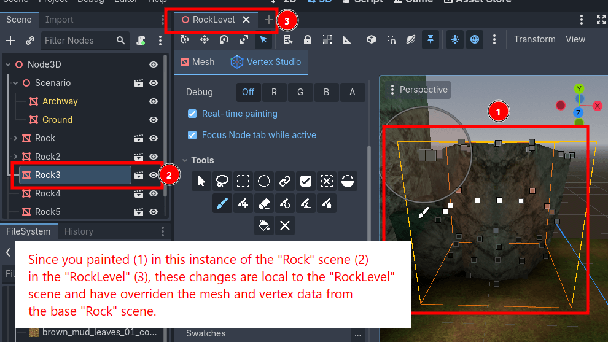

But if you ever want to revert back to the base mesh, you have to either delete the instance from the Scene Tree and add a new instance again or use a Vertex Studio Pro feature called ``Variations`` as well the ``VSRuntime`` node, that allows you to switch variations in the Inspector and during runtime, and to also revert back to the base scene at any time, in a non-destructive way.

For example, if you want to create different seasons or a day night cycle in your game, you can use ``Variations`` to create different variations of the base mesh and switch between them in the Inspector and during runtime/in-game as well.

In your simple tutorial scene, let's create variations of the rock mesh in order to demonstrate the ``Variations`` and the ``VSRuntime`` node features.

.. note::
    Internally, ``Variations`` are called ``Snapshots``, since they capture a full snapshot of Vertex Studio, attributes and vertex data at the time a snapshot is saved/overwritten: normal and surface topology, vertex colors, vertex groups and active selection. That means with snapshots/variations you can save and restore selections, switch different vertex groups, alternate different vertex and face hardness and smoothness (thanks to the ``Paint Normals`` brush), and of course, alternate different vertex colors as well.

.. video:: _static/videos/vertexstudio-tutorial08-variations.mp4
  :width: 100%

1. Open the "Rock" base scene, clear any active selection (click the ``Deselect`` button or press :kbd:`Shift+L`) and press the ``Erase All`` button.

2. Select the bottom vertices and fill them with black with around 80%-90% opacity.

3. OPTIONAL: while the selection is still active, you can create a ``Vertex Group`` with the bottom vertices, to avoid having to re-select the bottom vertices again from scratch in the feature. For that, expand the ``Vertex Groups`` section and click the ``+`` button, name the group and save it. Now, you can double click the vertex group at any time to re-select those same vertices.

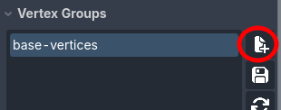

4. Go to the ``Variations`` section and click the ``+`` button to create a new variation. Variations are saved as Godot's Resource files, so choose a folder and save the variation resource file, for example "base-shadow".

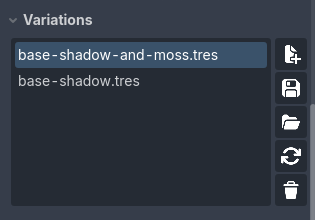

5. Now paint the top part with a different color, for example, green, and create another variation, for example "base-shadow-and-moss". Now you can double click a variation name to switch to that variation.

6. If you ever make changes and want them stored in a variation, you must click the save button.

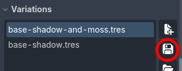

7. Now, clear the selection and erase everything from the mesh yet again. Now the base mesh has no vertex colors.

8. Scroll down, and in the ``Runtime`` section, click ``Add runtime node``. Check the Scene Tree that a ``VSRuntime`` node was added as a children of the ``MeshInstance3D`` node. 

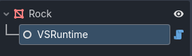

9. Hit save and go back to the "RockLevel" scene. Now, notice the "Rock" nodes have a ``VSRuntime`` node as a children. If you can't see, right-click a "Rock" node and check ``Editable Children``.

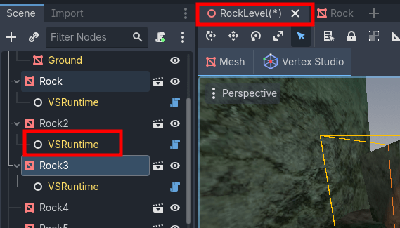

10. Click a ``VSRuntime`` node and notice the ``Variation`` dropdown in the Inspector. Alternate between variations and see the result in the viewport. Also, you can select ``None`` to revert back to the base mesh, and if you overrode the mesh in this world instance, you can click ``Restore base instance`` anytime.

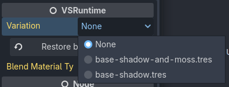

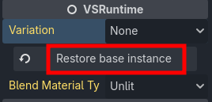
