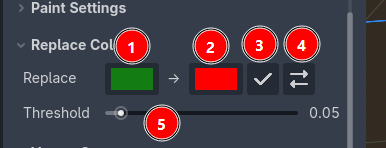

Replace Colors
=========================================

.. note::
    This feature requires Vertex Studio Pro ⭐.

``Replace Colors`` swaps one color for another across the mesh, within an adjustable tolerance. It's possible to change a color and similar colors (depending on the threshold you set) in the whole mesh in one click instead of going over every vertex again.

1. Source color: the color to look for. Click it to open the color picker.
2. Target color: the color to write in its place. Click it to open the color picker.
3. Replace: apply the replacement.
4. Swap: invert the source and the target colors, useful to undo a replacement by hand or to alternate between two colors.
5. Threshold: how close a vertex color has to be to the source color to be replaced. The higher the threshold, the more colors are replaced.

Threshold
---------

The threshold is a per channel tolerance, from ``0.0`` to ``1.0``:

- ``0.0``: only exact matches are replaced.
- Higher values: similar colors are replaced too.

So if you painted the same color with different opacities (which is common, since every stroke builds the color up), raise the threshold to catch all those shades when doing the replacement, or use a low threshold to replace only the specific "source" color.

.. video:: _static/videos/replace-colors.mp4

.. important::
    ``Replace`` always runs over every vertex of the mesh (and of its children meshes), it is not limited by the active selection, and it replaces the full RGBA color, not only the selected channel.

.. tip::
    ``Replace Colors`` is also covered by the undo history, so you can :kbd:`Ctrl+Z` to undo a replacement, normally.
