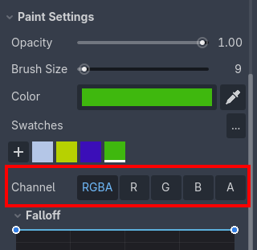
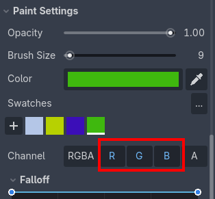
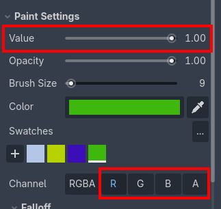

R/G/B/A Channels
================

Color channel selection is available in the ``Paint Settings`` section, after ``Swatches``, in ``Channel``:

- Default mode: ``RGBA`` (all channels).
- Single channel mode: click the separate ``R``, ``G``, ``B`` or ``A`` buttons to paint in the respective channel.
- Additive mode: hold :kbd:`Shift` and click the ``R``, ``G``, ``B`` or ``A`` buttons to paint in the respective channel additively.

Grayscale value painting
------------------------

The ``Value`` slider appears after selecting just one of the individual channels. It represents the channel grayscale value. Range is from ``0.0`` to ``1.0``, where ``0.0`` is pure black and ``1.0`` is white.

To set the value of the channel, you can use the ``Brush``, ``Eraser`` or the ``Fill`` tools normally. Selections, brush size and opacity are respected.

Channel visualization and debugging
----------------------------------

See :doc:`view-options`.

Usage examples
-----------------------

For example, you can use the alpha (``A``) channel as a weight factor for multi-texture blending. See :doc:`multi-texture-blending-tutorial`.