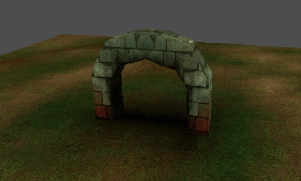
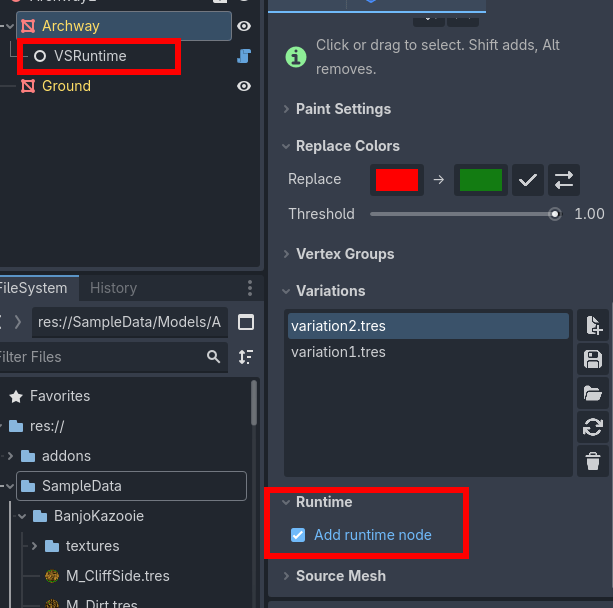
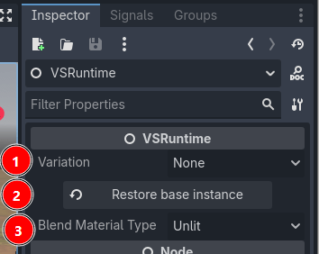

Runtime and API
=========================================

.. note::
    This feature requires Vertex Studio Pro ⭐.

``VSRuntime`` is a node that you add as a child of a ``MeshInstance3D`` to switch its :doc:`variations` from the Inspector and from code while the game is running, without overwriting the base mesh. It can also blend (tween) between variations over time, in-game.

Adding the runtime node
-----------------------

In the ``Runtime`` section of the panel, check ``Add runtime node``. A ``VSRuntime`` child is added to the selected ``MeshInstance3D``.

Unchecking the box removes the node and restores the mesh to its baseline.

.. note::
    If the mesh is inside an instanced scene, enable ``Editable Children`` on the instance to see and select the ``VSRuntime`` node in the Scene Tree.

The Inspector
-------------

1. ``Variation``: the variation to apply, listed from the mesh's variation history. Selecting ``None`` restores the baseline mesh, which is the state the instance had before a variation was applied to it.
2. ``Restore base instance``: reloads the mesh and the vertex groups from the scene file that owns this instance, dropping the local mesh override. Use it when you painted a world instance directly and want it linked back to the base scene, as if it had never been touched. See more in the :ref:`tutorial-base-and-world-instances` section of the quickstart tutorial.
3. ``Blend Material Type``: which of Vertex Studio's blend shaders (``Unlit`` or ``Lit``) is used while blending on the GPU. It has no effect outside of GPU blending.

.. note::
    ``Restore base instance`` cannot work on a duplicated child of an instance with ``Editable Children``, because in that case the link to the base instance is already lost.

Switching variations from code
------------------------------

Two ways, both instant (no blending):

.. code-block:: python

	# By resource path
	runtime.set_active_snapshot("res://Variations/arch-greenish.tres")

	# Or by index, the same order as the Inspector's Variation dropdown
	runtime.variation = 2

Blending between variations
---------------------------

``VSRuntime`` can also interpolate a mesh from one variation to another over a duration, on the GPU (faster, uses Vertex Studio's blend shaders) or on the CPU (slower, keeps your own custom shader).

.. warning::
    Blending can have performance implications. Switching variations instantly, as shown above, is fast and production ready.

The full walkthrough, with a sample project, is in the :doc:`blending-variations-runtime` tutorial.

.. _runtime-vsblendcycler:

The VSBlendCycler node
-------------------------------------------------

If all you want is a mesh that keeps blending through its variations, add a ``VSBlendCycler`` node to a ``MeshInstance3D`` that has a ``VSRuntime`` and press play: it finds the runtime next to it, reads the mesh's variations, and cycles through them (or ping-pongs between two), on the GPU or on the CPU, with the durations you set in the Inspector.

.. tip::
    The node is also an example of controlling ``VSRuntime`` from your own scripts: everything it does uses the VSRuntime :ref:`runtime-and-api-api-reference`. Source code in ``addons/vertex_studio/core/vs_blend_cycler.gd``.

VSBlendCycler properties
^^^^^^^^^^^^^^^^^^^^^^^^^

- ``Runtime``: the ``VSRuntime`` to drive. Leave it empty to use the one next to the node.
- ``Mode``:

  - ``Cycle All``: walk every variation of the mesh in order, looping.
  - ``Ping Pong``: bounce between two variations, chosen in the ``Ping Pong`` group below (leave the two empty to make it use the mesh's first two variations).

- ``Blend Duration``: time in seconds.
- ``Hold Time``: time in seconds to rest on a variation before blending onward.
- ``Include Baseline``: include the base mesh (``None``) as a step of the cycle.
- ``Play On Start``: start blending automatically when the scene runs (when off, it needs to be started from code).
- ``Blend Engine``: ``GPU`` or ``CPU``, the two engines described above. ``GPU`` is much cheaper per frame but renders the mesh with Vertex Studio's blend shader while the blend runs (``Unlit`` or ``Lit``, per the ``VSRuntime`` node's ``Blend Material Type``); ``CPU`` keeps the mesh's own material.
- ``Verbose``: print every transition, to see what the cycle is doing.

Driving VSBlendCycler from code
^^^^^^^^^^^^^^^^^^^^^^^^^^^^^^^^

.. code-block:: python

	@onready var cycler: VSBlendCycler = get_node("Archway/VSBlendCycler")

	func _ready() -> void:
	    # Start the cycle (when Play On Start is unchecked)
	    cycler.start_blending()

	    # Stop it
	    cycler.stop_blending()

	    # Blend to one specific variation and stay there ("" is the baseline)
	    cycler.blend_to("res://Variations/arch-greenish.tres")

``start_blending()`` re-reads the variation list every time it is called (it's also how you restart the cycle).

.. _runtime-and-api-api-reference:

API reference
-------------

Public API of the ``VSRuntime`` node. Variations are called snapshots in the code, and an empty string ``""`` as a path means "None", the instance baseline.

.. code-block:: python

	# Emitted when a blend started with tween_snapshots() / tween_to_snapshot() ends
	signal snapshot_blend_finished(to_path: String)

	# Variation index, the same as the Inspector's Variation dropdown
	var variation: int

	# Switching
	func set_active_snapshot(path: String) -> void
	func get_active_snapshot() -> String
	func get_snapshots_file_paths() -> PackedStringArray

	# Blending on the GPU
	func tween_snapshots(from_path: String, to_path: String, duration: float = 1.0) -> bool
	func tween_to_snapshot(to_path: String, duration: float = 1.0) -> bool
	func stop_snapshot_blend() -> void

	# Blending on the CPU (same behaviour, keeps your custom material)
	func tween_snapshots_cpu(from_path: String, to_path: String, duration: float = 1.0) -> bool
	func tween_to_snapshot_cpu(to_path: String, duration: float = 1.0) -> bool
	func stop_snapshot_blend_cpu() -> void

The ``tween_*`` functions return ``false`` when the two endpoints can't be resolved or don't share the same topology, in which case the target variation is applied instantly instead.

Example:

.. code-block:: python

	@onready var runtime: VSRuntime = get_node("Rock/VSRuntime")

	func _ready() -> void:
	    runtime.snapshot_blend_finished.connect(_on_blend_finished)
	    runtime.tween_to_snapshot("res://Variations/rock-mossy.tres", 2.0)

	func _on_blend_finished(reached_path: String) -> void:
	    print("blend finished at: ", reached_path)

.. tip::
	See the :doc:`blending-variations-runtime` tutorial for examples, sample project and more information.