Troubleshooting
=========================================

I have performance issues. It's slow to paint vertex colors with Vertex Studio.
----------------------------

Try the following settings and toggles under "View", in order of importance:

1. **Keep "Hide Inspector while active".** If nothing happens, close Vertex Studio and open it again (you can deselect your Mesh from the Scene Tree and re-select it). The important thing is that the Godot's Inspector must not be the active tab while painting (don't ask me why, but it removes most performance issues).
2. **Reduce "Draw Dist".**
3. **Disable "Always Show Vertices"** (only vertices under the cursor or under selections will appear).
4. **Disable "Show Wireframe"**.
5. **Disable "Show Front Verts Only"** (caveat: there's no occlusion now when drawing, so you might end up drawing and selecting backface vertices).
6. **In extreme scenarios, disable "Real-time painting".** Notice that with this disabled, when you paint, your changes will appear only when you release the mouse button.

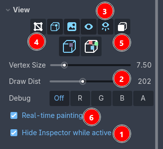

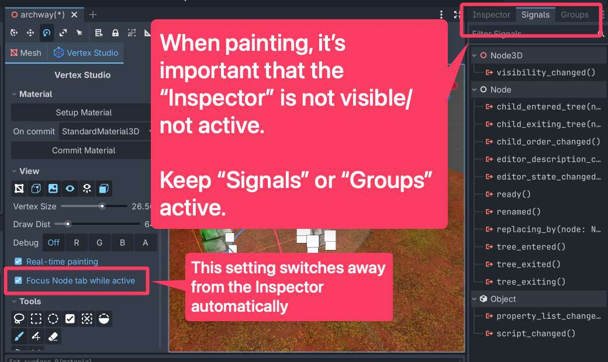


Lastly, **try zooming in the Godot 3D Viewport**, getting as close as you can to your mesh and to the vertices that you want to work with, specially in denser meshes.
Zoomed out, thousands of vertices being rendered under the brush:

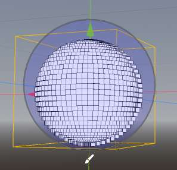

Zoomed in, just local vertices being rendered, the interface responsiveness is felt immediately:

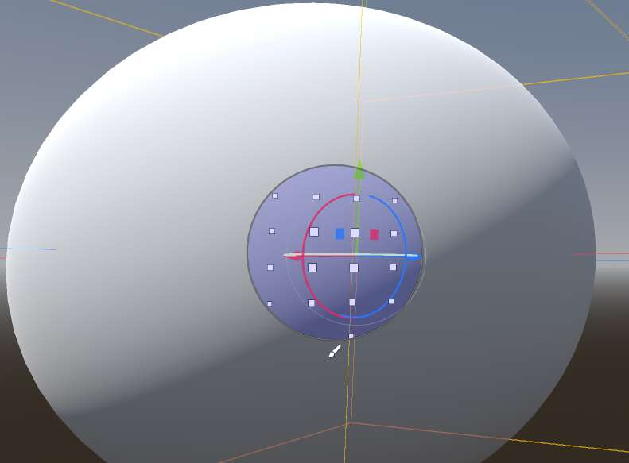

Vertex Colors do not appear in my model
---------------------------------------

- If you have Vertex Studio active, make sure your mesh has the "Setup Material" (either unlit or lit).

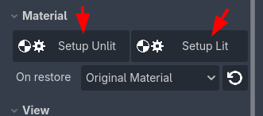

- If you are outside Vertex Studio and your model still does not show vertex colors, the mesh's material is not using the vertex color information. You can use Godot's ``StandardMaterial3D``, then check ``Vertex Color``, ``Use as Albedo``.

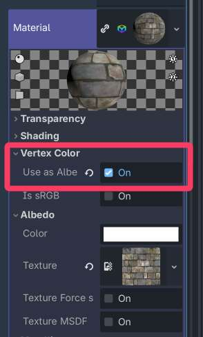

- If you want Vertex Studio to place the ``StandardMaterial3D`` in your mesh automatically, choose ``StandardMaterial3D`` in "Material - On restore".

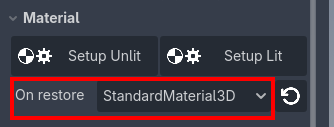
````
When I paint, nothing happens
---------------------------------------

- **No material:** make sure your mesh has a material.

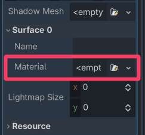

- **No vertex color information in the material:** make sure the mesh's material uses the vertex color. If you are in Vertex Studio, you can also click "Setup Unlit" or "Setup Lit" to use a material designed specially for the studio.


- **Wrong channel:** Make sure you are painting in the RGBA channel.

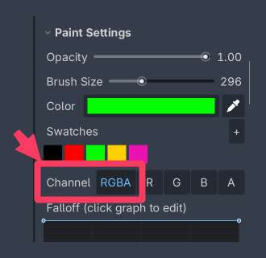

- **Incorrect vertex selection:** you might have a selection active and you are not painting in the selection. Either paint the selected vertices or deselect everything.

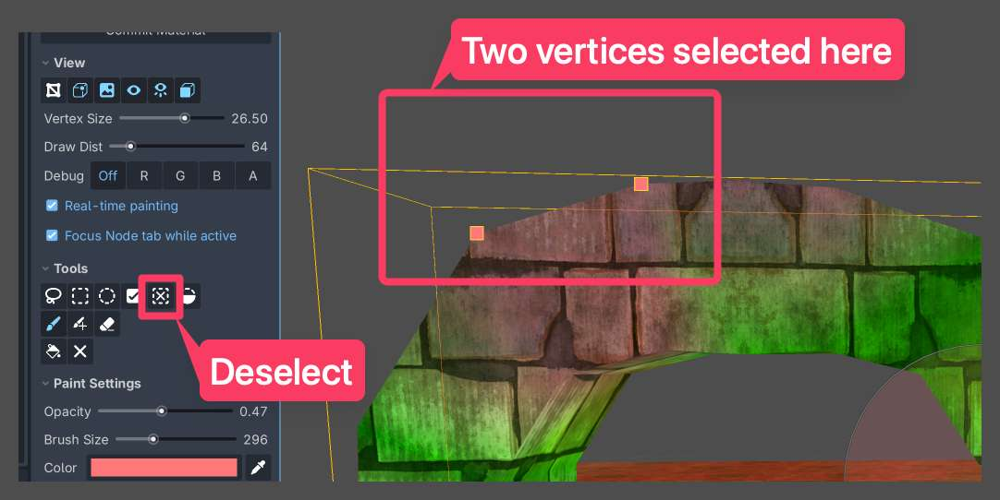

When I paint in one of the separate R/G/B/A channels, nothing happens
---------------------------------------------------------------------

- You can set the value of the channels directly by using the "Value" slider
- You can visualize the individual channels in the Debug view

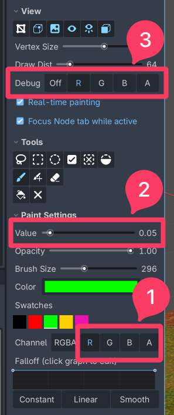

I can't see all of the mesh's vertices. The vertex I want is not showing up or I cannot paint it.
---------------------------------------

- Make sure you have "Show Vertices" active under "View". Also make sure "Vertex Size" and "Draw Dist" are in a reasonable value, so you can see the vertices.

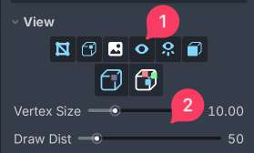

- Make sure you don't have a selection active with other vertices. If you have an active selection you can either:
	- Add more vertices to the selection (choose one of the selection tools, then hold ``Shift`` while making a new selection).
	- Or deselect everything or invert selection.

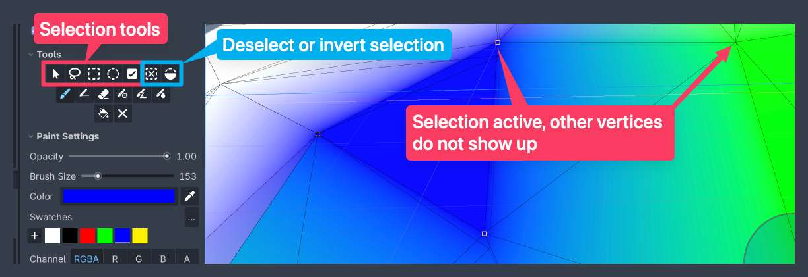

The Split Shared Verts view mode is active, but vertices still show up as a single, merged vertex
---------------------------------------

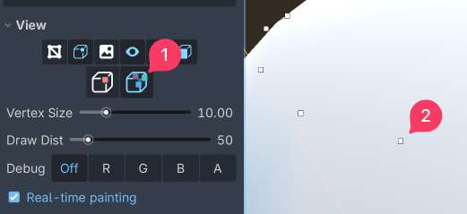

Split vertices work only on hard edges. You can either make flat and hard faces with the 3D software of your choice, like Blender or you can use Vertex Studio "Paint Normals" brush and paint individual faces and vertices as hard or smooth. By painting vertices hard, they are automatically split. By painting them smooth, they are welded as a merged vertex.

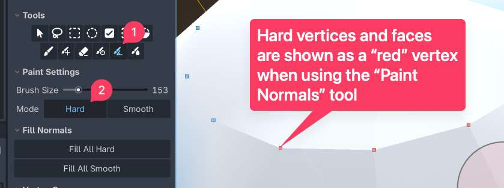

The scene file with the MeshInstance3D where I painted vertex colors is too big and/or is taking too long to load
---------------------------------------

Save the scene as a binary scene (``.scn``) instead of a text scene (``.tscn``).

The plugin font and icon colors do not match my Godot's theme
---------------------------------------

This shouldn't happen since the plugin watches for themes changes in the editor with (``NOTIFICATION_THEME_CHANGED``). But if for some reason you face this, in order to make the plugin match Godot's theme, disable and re-enable the plugin or restart the editor.

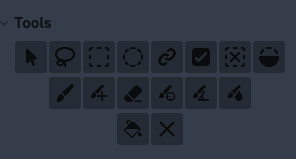

.. _troubleshooting-mesh-all-white:

The mesh is all white or I lost my vertex colors
---------------------------------------

If you are using a custom shader
^^^^^^^^^^^^^^^^^^^^^^^^^^^^^^^^^

- Make sure your custom shader uses the vertex color information somehow (like showing the colors themselves or using the colors for something else, like :doc:`blending textures <multi-texture-blending-tutorial>`).
- If your shader already uses the vertex color information, make sure you are using the correct RGBA channels (see :doc:`rgba-channels`).
- In Vertex Studio you can visualize the mesh with your original/custom material. In ``Material > On restore`` make sure the value is ``Original Material`` and then click the restore button. 

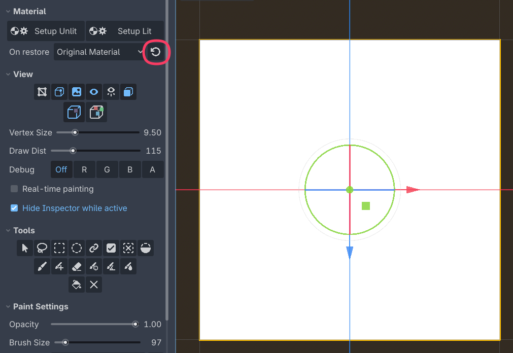

If you are not using a custom shader
^^^^^^^^^^^^^^^^^^^^^^^^^^^^^^^^^^^^^

- Make sure your mesh has at least one material assigned.
- In Vertex Studio you can just click ``Setup Unlit`` or ``Setup Lit`` to apply the setup painting material.
- In ``Material > On restore``, you can use ``StandardMaterial3D``, and then Vertex Studio will apply Godot's default material with ``Vertex Colors: Use as Albedo`` enabled.

Are you using the right view modes?
^^^^^^^^^^^^^^^^^^^^^^^^^^^^^^^^^^^^^

- Make sure ``Show Vertex Colors`` and ``Show Textures`` are enabled.

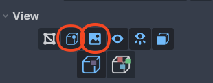

- Make sure you are not debugging a specific channel. In ``View > Debug`` click ``Off``.

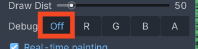

See the :doc:`material-setup` page for more.