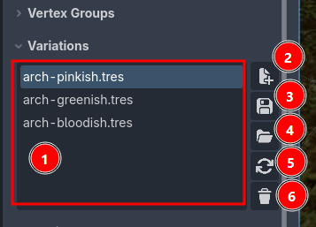
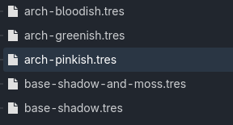
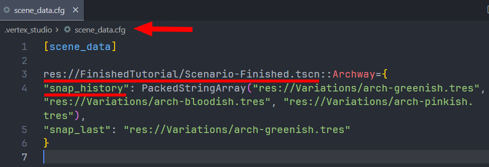

Variations
=========================================

.. note::
    This feature requires Vertex Studio Pro ⭐.

A Variation is a **full snapshot** of a mesh as Vertex Studio sees it, saved into a Godot Resource file. One mesh can have as many variations as you want, and you switch between them with a double-click, in the Inspector, or :doc:`at runtime with code <blending-variations-runtime>`.

This is what makes a non-destructive workflow possible: instead of painting over what you did before, you save the current look as a variation and keep painting. Variations can be used to save seasons, day and night, clean and damaged, dry and mossy, etc., all from the same mesh.

A variation captures ("snapshots it"):

- The vertex colors.
- The vertex and surface topology: positions, :doc:`UVs <mesh-tools>`, normals and tangents, including the hard and smooth splits made with the :ref:`paint-normals` brush.
- The active selection (the vertices that are selected in the viewport when you saved the variation).
- The :doc:`vertex-groups` of the mesh.

.. note::
    Internally, and in some file dialogs, variations are called ``Snapshots``. It's the same thing.

1. The variation history of this mesh. Click an entry to make it the active variation (so the other buttons act on it), double-click it to load and apply it to the mesh.
2. New: save the current state as a new variation. It asks where to save the resource file.
3. Save: overwrite the active variation with the current state.
4. Load: browse for a variation file that is not in the list.
5. Reload: load the active variation again, without browsing.
6. Delete: remove the active variation from the list **and delete its resource file from disk**.

Creating and switching variations
---------------------------------

1. Paint and change the mesh as you want.
2. Expand ``Variations`` and click ``+``, then choose a folder and a name, for example ``rock-mossy.tres``.
3. Keep painting, then click ``+`` again for the next look, for example ``rock-snow.tres``.
4. Double-click any entry in the list to switch the mesh to that variation.

.. video:: _static/videos/variation-switching.mp4

.. important::
    Painting after loading a variation does not update the file by itself. If you made changes that you want to keep in that variation, click the variation's save button.

.. warning::
    Loading a variation replaces the mesh's vertex colors, topology (including UVs, if they differ), selection **and** :doc:`vertex-groups` with what is stored in the file. 

Where the variations are stored
-------------------------------

Variation files are normal Godot Resources, saved wherever you chose, so they are part of your project and go into version control with it.

The list of variations belonging to each mesh is stored per mesh, in the node and in ``res://.vertex_studio/scene_data.cfg`` (see :doc:`project-settings`). If you delete a variation file outside of Godot, Vertex Studio drops it from the list the next time it opens that mesh.

Switching variations in the Inspector and at runtime
----------------------------------------------------

Add a ``VSRuntime`` node to the mesh to switch variations from the Inspector, from code at runtime, and to blend between two variations over time. See :doc:`runtime-and-api` and the :doc:`blending-variations-runtime` tutorial.

.. image:: _static/images/variation-blending/variationtween.gif

.. tip::
    For skeletal and skinned meshes, it's recommended to save selections and variations while the mesh is in a neutral pose. See :ref:`the FAQ <faq-skeletal-mesh>`.
