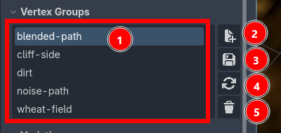

Vertex Groups
=========================================

.. note::
    This feature requires Vertex Studio Pro ⭐.

A Vertex Group is a named selection saved onto the mesh, exactly like Blender's vertex groups. Instead of re-selecting the same vertices every time you come back to a model (for example: the bottom of a rock where you paint ambient occlusion, the leaves of a tree, the eyes of a character), you select them once, save the group, and re-select them later with a double-click.

1. The list of groups saved on this mesh. Click a group to make it the active one, double-click it to select its vertices in the viewport.
2. New: create a group from the current selection. It asks for a name, and it's only available while there is an active selection.
3. Save: overwrite the active group with the current selection.
4. Reload: select the vertices stored in the active group (the same as double-clicking it).
5. Delete: remove the active group.

Usage
-----

1. Select the vertices you want with any of the :doc:`selection-tools`.
2. Expand ``Vertex Groups`` and click the ``+`` button, then name the group.
3. Whenever you need that selection again, double-click the group name.
4. If you make changes to a selection and want to update the vertex group, click the ``Save`` button.

.. video:: _static/videos/vertex-groups.mp4

.. tip::
    Groups are just selections, so everything that respects a selection respects them: after reloading a group, the brush, the eraser and ``Fill Selection`` only affect those vertices that are selected, just like when you select them manually.

Where the groups are stored
---------------------------

Groups are saved per mesh, so they follow the ``MeshInstance3D`` and are still there when you reopen the project. They are written both onto the node and into ``res://.vertex_studio/scene_data.cfg``, a project file you can commit to version control. See :doc:`project-settings`.

Groups store vertex **positions**, not vertex indices. That's on purpose: it means a group survives topology changes, so if you later split or weld vertices with the :ref:`paint-normals` brush (see :doc:`merge-and-split-shared-vertices`), the group still selects the right corners.

Vertex Groups and Variations
----------------------------

Every :doc:`Variation <variations>` carries its own set of vertex groups, captured when the variation is saved.

.. warning::
    Loading a variation **replaces** the mesh's vertex groups with the ones stored in that variation. If the variation was saved before you created a group (or with no groups at all), that group is gone from the mesh after loading it. Save the variation again after creating groups you want to keep.
